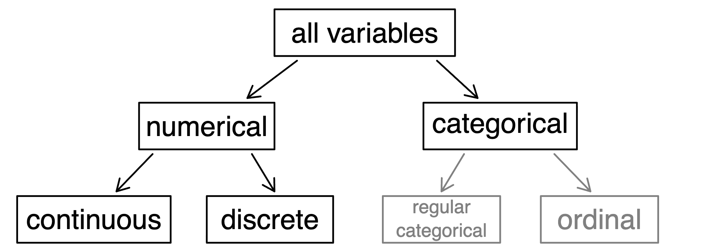
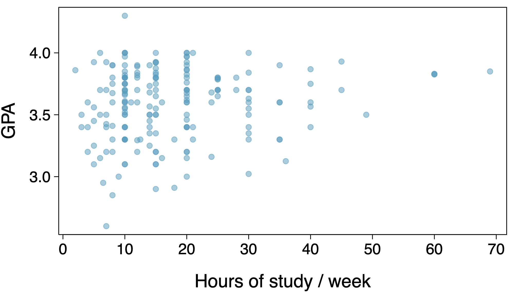
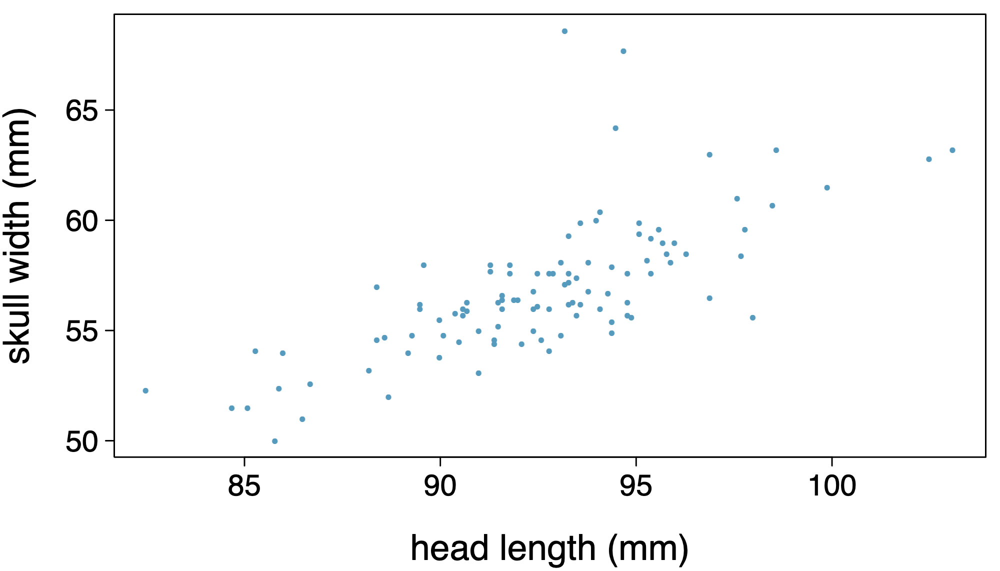

# Case study

## Treating Chronic Fatigue Syndrome

- **Objective:** Evaluate the effectiveness of cognitive-behavior therapy for chronic fatigue syndrome.
- **Participant pool:** 142 patients recruited from referrals by primary care physicians and consultants to a hospital clinic specializing in chronic fatigue syndrome.
- **Actual participants:** Only 60 of the 142 referred patients entered the study. Some were excluded because they didn't meet the diagnostic criteria, some had other health issues, and some refused to participate.

::: {style="font-size: 0.7em;"}
Deale et al. *Cognitive behavior therapy for chronic fatigue syndrome: A randomized controlled trial*. The American Journal of Psychiatry 154.3 (1997).
:::

## Study design

Patients were randomly assigned to treatment and control groups, 30 patients in each group:

- **Treatment:** Cognitive behavior therapy — collaborative, educative, and with a behavioral emphasis. Patients were shown how activity could be increased steadily and safely without exacerbating symptoms.
- **Control:** Relaxation — no advice was given about how activity could be increased. Instead, progressive muscle relaxation, visualization, and rapid relaxation skills were taught.

## Results

The table below shows the distribution of patients with good outcomes at 6-month follow-up. Note that 7 patients dropped out of the study: 3 from the treatment group and 4 from the control group.

|            |           | Good outcome: Yes | Good outcome: No | Total |
|------------|-----------|:---:|:---:|:---:|
| **Group**  | Treatment | 19  | 8   | 27  |
|            | Control   | 5   | 21  | 26  |
|            | **Total** | 24  | 29  | 53  |

. . .

- Proportion with good outcomes in treatment group: $19/27 \approx 0.70 \rightarrow 70\%$
- Proportion with good outcomes in control group: $5/26 \approx 0.19 \rightarrow 19\%$

## Understanding the results

> Do the data show a "real" difference between the groups?

. . .

- Suppose you flip a coin 100 times. While the chance a coin lands heads in any given flip is 50%, we probably won't observe exactly 50 heads. This type of fluctuation is part of almost any data-generating process.
- The observed difference between the two groups (70% − 19% = 51 percentage points) may be real, or may be due to natural variation.
- Since the difference is quite large, it is more believable that the difference is real.
- We need statistical tools to determine if the difference is large enough that we should reject the notion that it was due to chance.

## Generalizing the results

> Are the results of this study generalizable to all patients with chronic fatigue syndrome?

. . .

These patients had specific characteristics and volunteered to be part of this study, so they may not be representative of all patients with chronic fatigue syndrome. While we cannot immediately generalize the results, this first study is encouraging — the method works for patients with some narrow set of characteristics, which gives hope that it will work, at least to some degree, with other patients.

# Data basics

## Classroom survey

A survey was conducted on students in an introductory statistics course. Below are a few of the questions, and the corresponding variables the responses were stored in:

- `gender`: What is your gender?
- `intro_extra`: Do you consider yourself introverted or extraverted?
- `sleep`: How many hours do you sleep at night, on average?
- `bedtime`: What time do you usually go to bed?
- `countries`: How many countries have you visited?
- `dread`: On a scale of 1–5, how much do you dread being here?

## Data matrix

Data collected on students in a statistics class on a variety of variables:

| Stu. | `gender` | `intro_extra` | $\cdots$ | `dread` |     |
|:---:|:---:|:---:|:---:|:---:|-----|
| 1  | male   | extravert | $\cdots$ | 3 |               |
| 2  | female | extravert | $\cdots$ | 2 |               |
| 3  | female | introvert | $\cdots$ | 4 | $\leftarrow$ **observation** |
| 4  | female | extravert | $\cdots$ | 2 |               |
| $\vdots$ | $\vdots$ | $\vdots$ | $\vdots$ | $\vdots$ | |
| 86 | male   | extravert | $\cdots$ | 3 |               |

Each **column** is a variable; each **row** is an observation.

## Types of variables

{width="80%"}

## Types of variables (cont.)

| | `gender` | `sleep` | `bedtime` | `countries` | `dread` |
|---|:---:|:---:|:---:|:---:|:---:|
| 1 | male   | 5   | 12–2  | 13 | 3 |
| 2 | female | 7   | 10–12 | 7  | 2 |
| 3 | female | 5.5 | 12–2  | 1  | 4 |
| 4 | female | 7   | 12–2  |    | 2 |
| 5 | female | 3   | 12–2  | 1  | 3 |
| 6 | female | 3   | 12–2  | 9  | 4 |

::: {.incremental}
- `gender`: **categorical**
- `sleep`: **numerical, continuous**
- `bedtime`: **categorical, ordinal**
- `countries`: **numerical, discrete**
- `dread`: **categorical, ordinal** — could also be used as numerical
:::

## Practice

**What type of variable is a telephone area code?**

a. numerical, continuous
b. numerical, discrete
c. categorical
d. categorical, ordinal

. . .

**Answer: (c) categorical** — even though area codes are numbers, arithmetic on them is meaningless.

## Relationships among variables

> Does there appear to be a relationship between GPA and number of hours students study per week?

{width="70%"}

. . .

> Can you spot anything unusual about any of the data points?

. . .

There is one student with GPA $> 4.0$ — this is likely a data error.

## Explanatory and response variables

- To identify the explanatory variable in a pair of variables, identify which of the two is suspected of affecting the other:

$$\text{explanatory variable} \xrightarrow{\text{might affect}} \text{response variable}$$

- Labeling variables as explanatory and response does **not** guarantee the relationship between the two is actually causal, even if there is an association identified between the two variables. We use these labels only to keep track of which variable we suspect affects the other.

## Two primary types of data collection

- **Observational studies:** Collect data in a way that does not directly interfere with how the data arise (e.g. surveys).
  - Can provide evidence of a naturally occurring association between variables, but cannot by themselves show a causal connection.

. . .

- **Experiment:** Researchers randomly assign subjects to various treatments in order to establish causal connections between the explanatory and response variables.

## Association vs. causation

- When two variables show some connection with one another, they are called **associated** variables.
  - Associated variables can also be called **dependent** variables, and vice versa.
- If two variables are not associated — i.e., there is no evident connection between the two — then they are said to be **independent**.
- In general, association does not imply causation, and causation can only be inferred from a randomized experiment.

## Practice

**Based on the scatterplot, which statement is correct about the head and skull lengths of possums?**

{width="70%"}

## Practice Cont 
**Based on the scatterplot, which statement is correct about the head and skull lengths of possums?**

a. There is no relationship between head length and skull width — the variables are independent.
b. Head length and skull width are positively associated.
c. Skull width and head length are negatively associated.
d. A longer head causes the skull to be wider.
e. A wider skull causes the head to be longer.

. . .

**Answer: (b)** — an association, not a causal claim.
