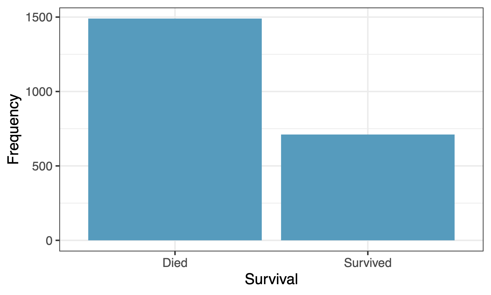
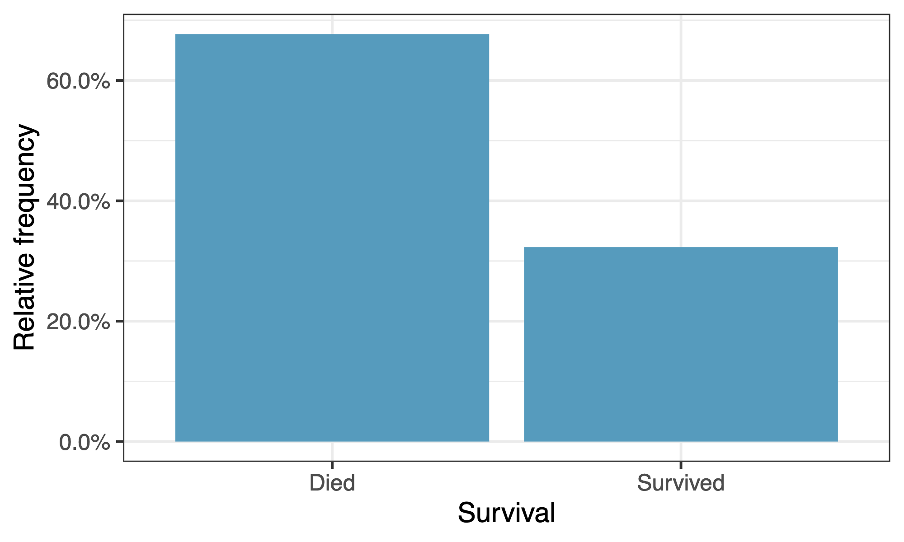
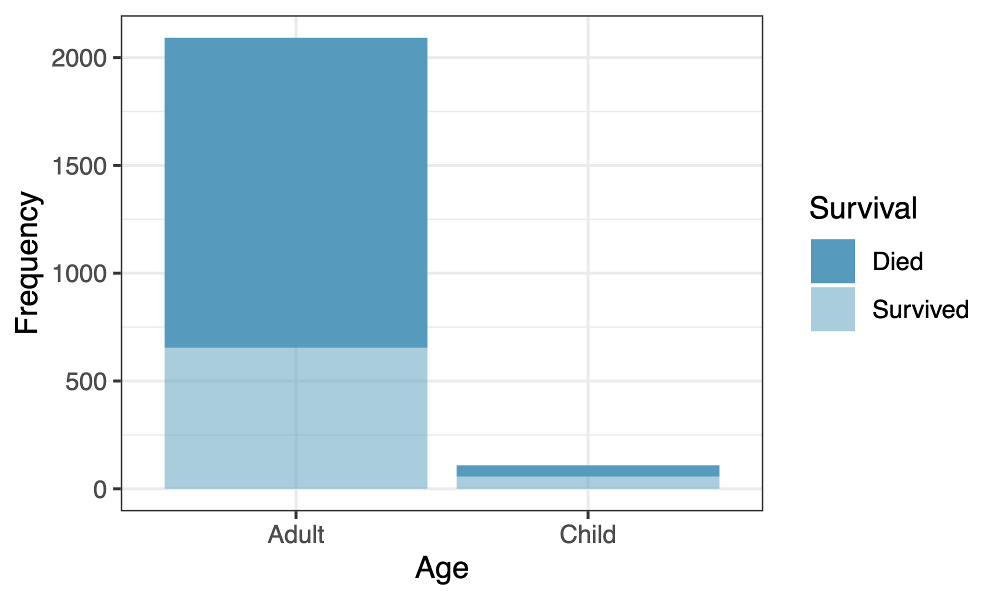
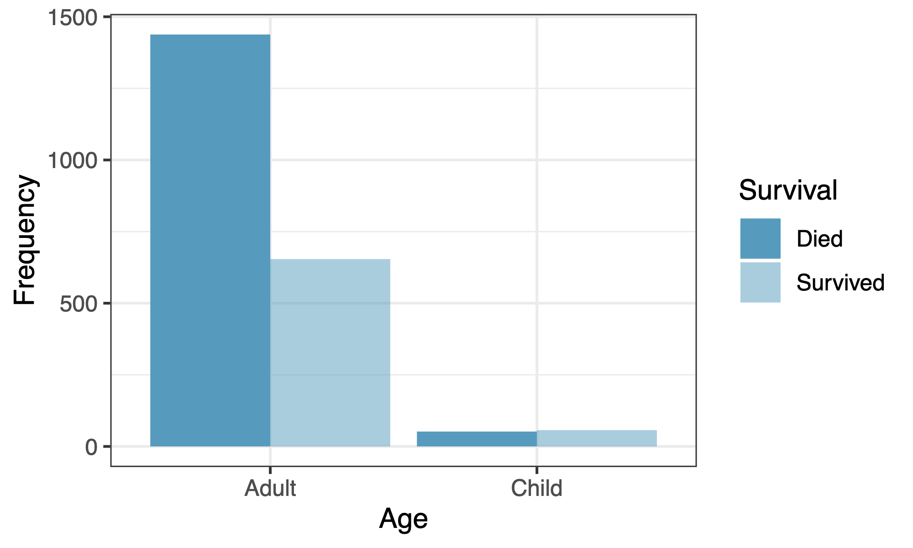
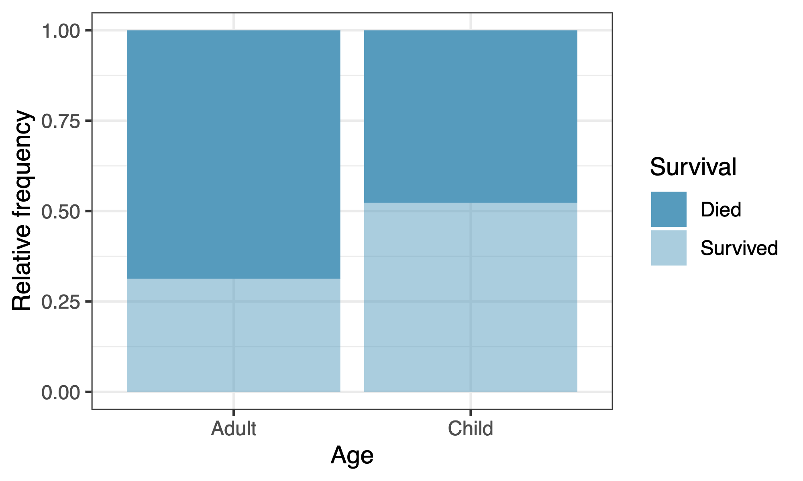
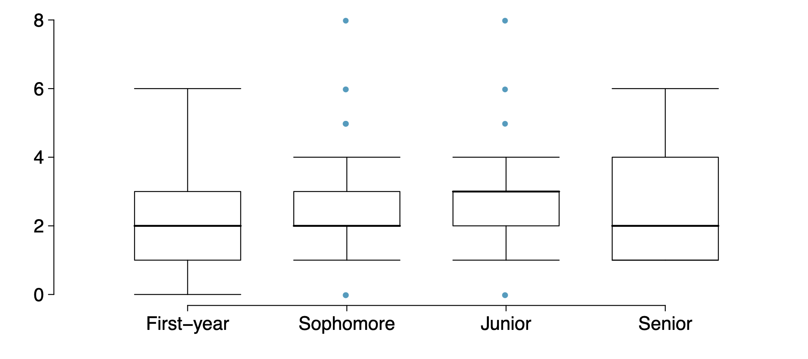

# Categorical data

## Contingency tables

A table that summarizes data for two categorical variables is called a **contingency table**.

The contingency table below shows the distribution of survival and age of passengers on the Titanic.

|          |       | Died | Survived | Total |
|----------|-------|:----:|:--------:|:-----:|
| **Age**  | Adult | 1438 |   654    | 2092  |
|          | Child |  52  |    57    |  109  |
|          | Total | 1490 |   711    | 2201  |

## Bar plots

A **bar plot** is a common way to display a single categorical variable. A bar plot showing proportions instead of frequencies is called a **relative frequency bar plot**.
ti

::: {.columns}
::: {.column width="50%"}

:::
::: {.column width="50%"}

:::
:::
. . .

> How are bar plots different from histograms?

. . .

Bar plots display categorical variables; histograms display numerical variables. A histogram's x-axis is a number line, so bar order is fixed — a bar plot's categories can be reordered.

## Choosing the appropriate proportion

> Does there appear to be a relationship between age and survival for Titanic passengers?

|          |       | Died | Survived | Total |
|----------|-------|:----:|:--------:|:-----:|
| **Age**  | Adult | 1438 |   654    | 2092  |
|          | Child |  52  |    57    |  109  |
|          | Total | 1490 |   711    | 2201  |

. . .

To answer this, we look at **row proportions**:

- % Adults who survived: $654/2092 \approx 0.31$
- % Children who survived: $57/109 \approx 0.52$

## Bar plots with two variables

- **Stacked bar plot:** graphical display of contingency table counts, stacked on top of each other.
- **Side-by-side bar plot:** the same information, with bars placed next to each other instead of stacked.
- **Standardized (filled) bar plot:** graphical display of contingency table *proportions* rather than counts.

## Comparing the three

::: {.columns}
::: {.column width="33%"}

:::
::: {.column width="33%"}

:::
::: {.column width="33%"}

:::
:::

> What are the differences between the three visualizations above? When would you reach for the standardized version instead of the stacked one?

## Comparing a numerical variable across groups

Side-by-side boxplots let us compare a **numerical** variable across levels of a **categorical** variable.

> Does there appear to be a relationship between class year and number of clubs students are in?

This is the bridge between what we just did (categorical) and what's coming (numerical/discrete) — the *grouping* variable is categorical, but what we're measuring within each group is numerical.

# Discrete distributions

## Random processes

- A **random process** is a situation where we know what outcomes could happen, but not which particular outcome will happen.
- Examples: coin tosses, die rolls, whether tomorrow's high temperature is above 70°F.
- It can be useful to *model* a process as random even if it isn't truly random (e.g., shuffle algorithms).

## Probability basics

- $P(A)$ = probability of event $A$
- $0 \le P(A) \le 1$

. . .

**Frequentist interpretation:** the probability of an outcome is the proportion of times it would occur if we repeated the random process infinitely many times.

## Disjoint vs. non-disjoint outcomes

**Disjoint (mutually exclusive):** cannot happen at the same time.

- The outcome of a single coin toss cannot be both heads and tails.
- A single card drawn from a deck cannot be both an ace and a queen.

. . .

**Non-disjoint:** can happen at the same time.

- A student can get an A in Stats and an A in Econ in the same semester.

## Probability distributions

A **probability distribution** lists all possible events and the probability with which each occurs.

The distribution for the gender of one kid:

| Event | Male | Female |
|---|:---:|:---:|
| Probability | 0.5 | 0.5 |

## Rules for probability distributions:

1. The events listed must be disjoint.
2. Each probability must be between 0 and 1.
3. The probabilities must total 1.

. . .

The distribution for the genders of two kids:

| Event | MM | FF | MF | FM |
|---|:---:|:---:|:---:|:---:|
| Probability | 0.25 | 0.25 | 0.25 | 0.25 |

## Practice

**Which of these variables would you expect to be uniformly distributed?**

a. weights of adult females
b. salaries of a random sample of people from North Carolina
c. house prices
d. birthdays of classmates (day of the month)

. . .

**Answer: (d)** — day-of-month birthdays have no reason to cluster around any particular value, unlike the other three, which are all right-skewed.

## Random variables

- A **random variable** is a numeric quantity whose value depends on the outcome of a random event.
  - We use a capital letter, like $X$, to denote a random variable, and lowercase $x$ for its possible values — e.g. $P(X = x)$.
- **Discrete random variables** often take only integer values.
  - Example: number of credit hours this term.
- **Continuous random variables** take real (decimal) values.
  - Example: cost of textbooks this term. *(We'll come back to continuous variables on Wednesday.)*

## Expected value

We're often interested in the *average* outcome of a random variable — this is the **expected value** (mean), a weighted average of the possible outcomes:

$$\mu = E(X) = \sum_{i=1}^k x_i \, P(X = x_i)$$

## Expected value: a card game

> In a game of cards you win \$1 if you draw a heart, \$5 if you draw an ace (including the ace of hearts), \$10 if you draw the king of spades, and nothing for any other card. Write the probability model for your winnings, and calculate your expected winnings.

. . .

| Event | $X$ | $P(X)$ | $X \cdot P(X)$ |
|---|:---:|:---:|:---:|
| Heart (not ace) | 1 | 12/52 | 12/52 |
| Ace | 5 | 4/52 | 20/52 |
| King of spades | 10 | 1/52 | 10/52 |
| All else | 0 | 35/52 | 0 |
| **Total** |  |  | $E(X) = 42/52 \approx 0.81$ |

So on average, you'd expect to win about 81 cents per game.
