# Numerical data

## Scatterplots

**Scatterplots** are useful for visualizing the relationship between two numerical variables.

::: {.columns}
::: {.column width="55%"}
> Do life expectancy and total fertility appear to be associated or independent?

> Was the relationship the same throughout the years, or did it change?
:::
::: {.column width="45%"}
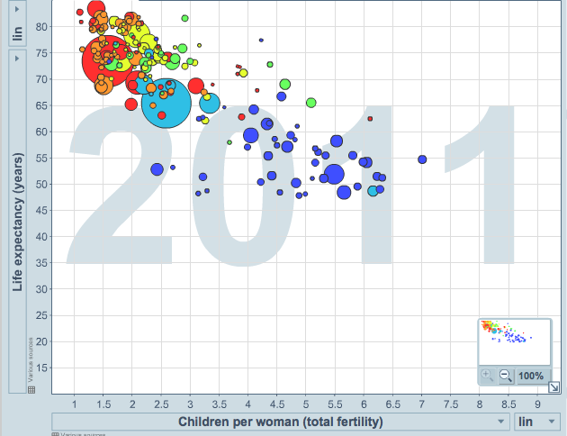{width=95%}
:::
:::

. . .

They appear to be linearly and negatively associated — as fertility increases, life expectancy decreases — and this relationship changed over time.

## Dot plots & the mean

Dot plots are useful for visualizing one numerical variable. The **mean** (average) — marked with a triangle below — is one way to measure the center of a distribution.

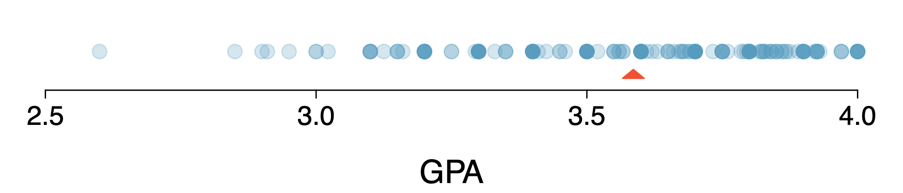{width=70% fig-align="center"}

$$\bar{x} = \frac{x_1 + x_2 + \cdots + x_n}{n}$$

The sample mean $\bar{x}$ is a **point estimate** of the population mean $\mu$ — not perfect, but usually good if the sample is representative.

## Histograms & bin width

Histograms show the **density** of the data — where values are relatively more common — and are especially useful for describing **shape**. The chosen **bin width** can change the story the histogram tells.

::: {layout-ncol=4}
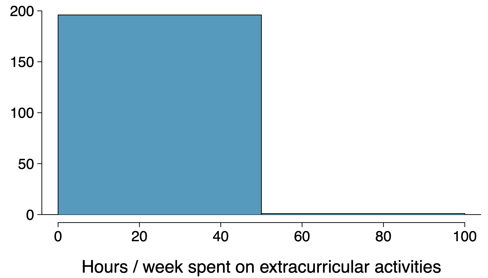

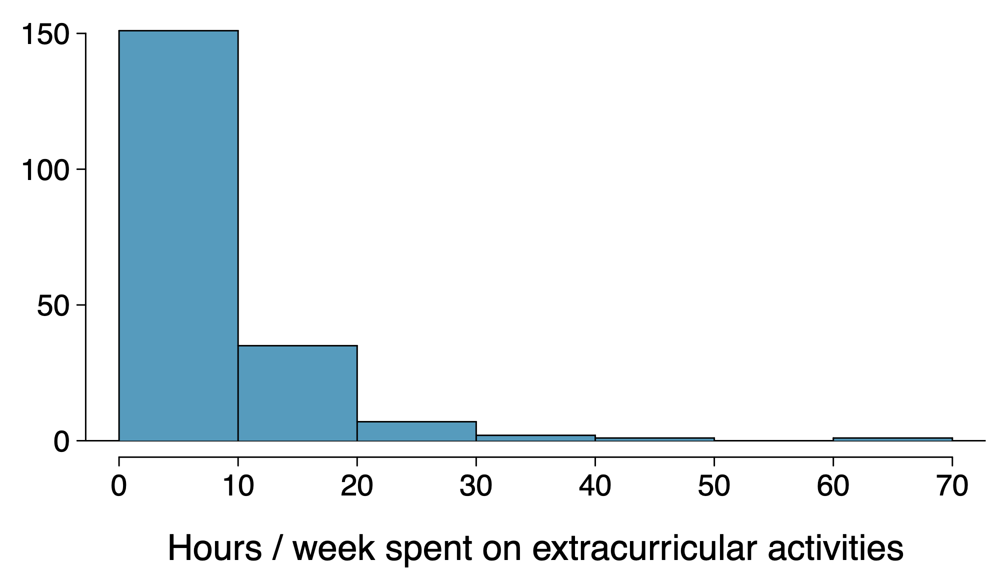

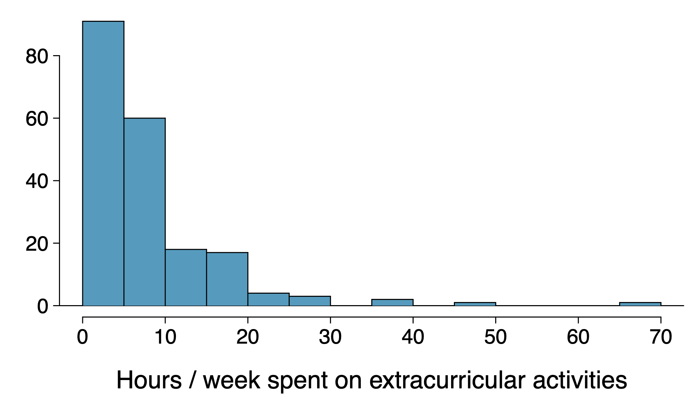

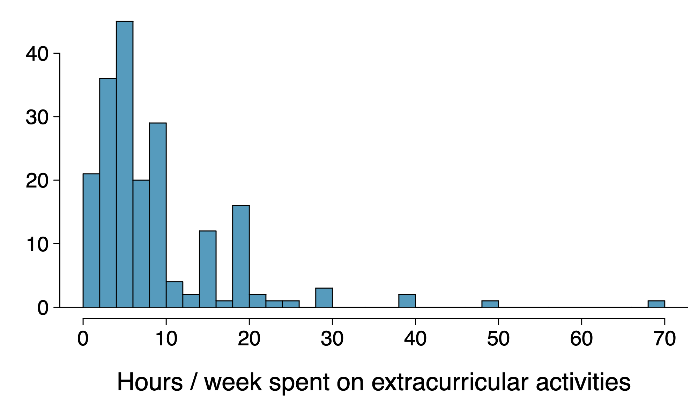
:::

> Which of these are useful? Which reveal too much? Which hide too much?

## Shape of a distribution

**Modality:** does the histogram have one prominent peak (unimodal), several (bi/multimodal), or none (uniform)?

**Skewness:** is the histogram right skewed, left skewed, or symmetric? (Named for the side of the long tail.)

::: {.columns}
::: {.column width="50%"}
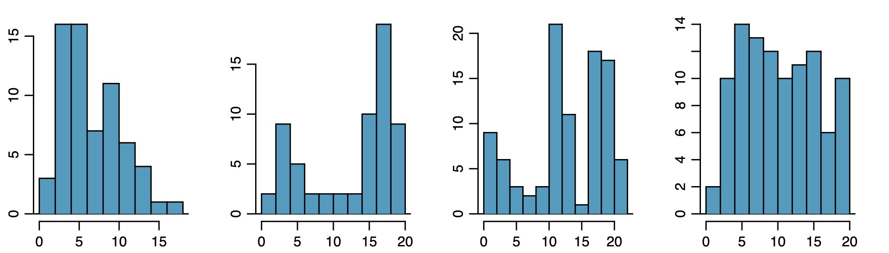{width=95%}
:::
::: {.column width="50%"}
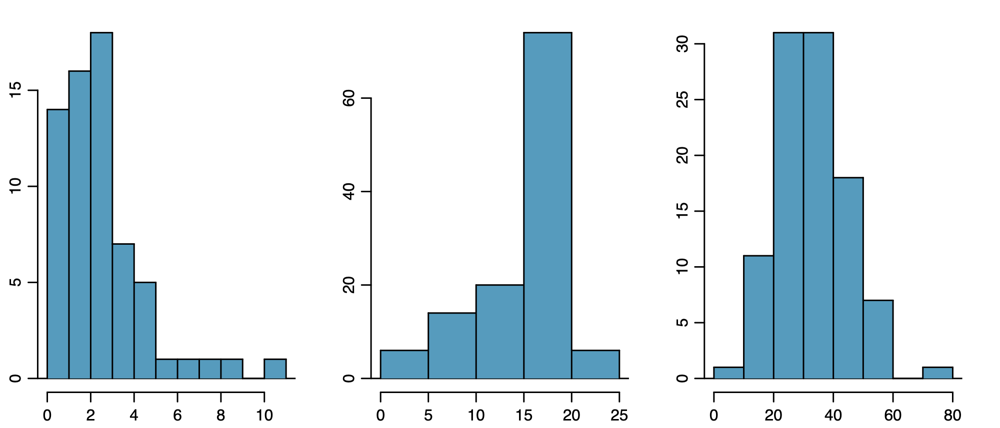{width=95%}
:::
:::

## Unusual observations

Are there any unusual observations, or potential **outliers**?

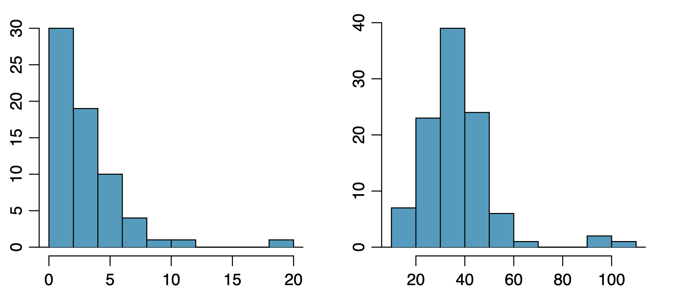{width=80% fig-align="center"}

Outliers are worth flagging: they can signal extreme skew, data-entry errors, or genuinely interesting features of the data.

## Variance and standard deviation

**Variance** is roughly the average squared deviation from the mean:

$$s^2 = \frac{\sum_{i=1}^n (x_i - \bar{x})^2}{n-1}$$

The **standard deviation** is the square root of the variance, in the same units as the data:

$$s = \sqrt{s^2}$$

. . .

For a sample of students' sleep hours, $\bar{x} = 6.71$ and $n = 217$:

$$s^2 = \frac{(5-6.71)^2 + (9-6.71)^2 + \cdots + (7-6.71)^2}{217-1} = 4.11 \Rightarrow s = \sqrt{4.11} \approx 2.03 \text{ hours}$$

We square the deviations so that observations equally far from the mean count equally, and larger deviations are weighted more heavily.

## Median, quartiles, and IQR

- The **median** splits the ordered data in half — 50% of values fall below it, so it's also the $50^{th}$ percentile.
  - Odd $n$: the middle value. Even $n$: the average of the two middle values.
- The $25^{th}$ percentile is the first quartile, **Q1**. The $75^{th}$ percentile is the third quartile, **Q3**.
- The middle 50% of the data spans the **interquartile range**:

$$IQR = Q3 - Q1$$

## Box plots

The box represents the middle 50% of the data; the thick line is the median.

::: {.columns}
::: {.column width="50%"}
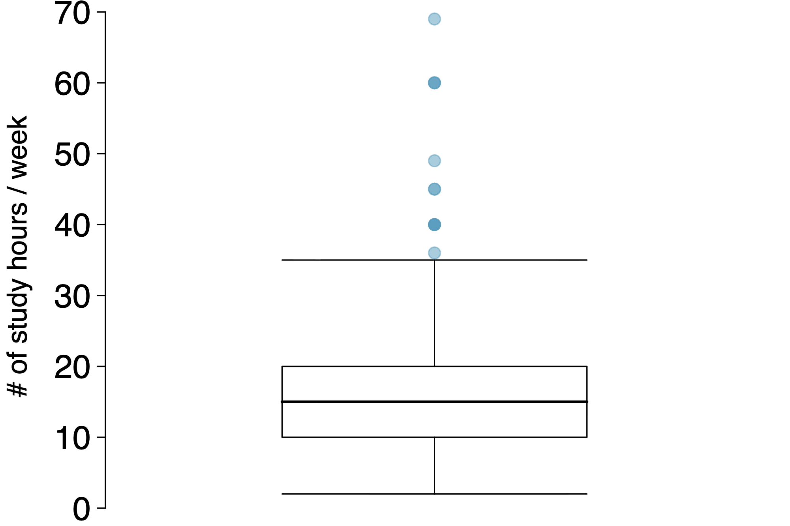{width=95%}
:::
::: {.column width="50%"}
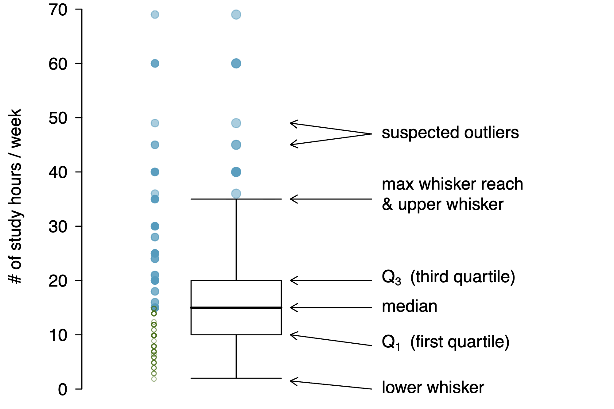{width=95%}
:::
:::

**Whiskers** extend up to $1.5 \times IQR$ beyond the quartiles:

$$\text{max whisker reach} = Q3 + 1.5 \times IQR \quad \text{or} \quad Q1 - 1.5 \times IQR$$

A point beyond that reach is a potential **outlier**.

## Robust statistics

Median and IQR are more **robust** to skew and outliers than mean and SD.

| scenario | median | IQR | $\bar{x}$ | $s$ |
|---|:---:|:---:|:---:|:---:|
| original data | 190K | 200K | 245K | 226K |
| move largest to \$10M | 190K | 200K | 309K | 853K |
| move smallest to \$10M | 200K | 200K | 316K | 854K |

For **skewed** distributions, prefer median/IQR to describe center/spread. For **symmetric** distributions, mean/SD are typically more informative.

## Mean vs. median

::: {.columns}
::: {.column width="60%"}
- **Symmetric:** mean $\approx$ median
- **Right-skewed:** mean $>$ median
- **Left-skewed:** mean $<$ median
:::
::: {.column width="40%"}
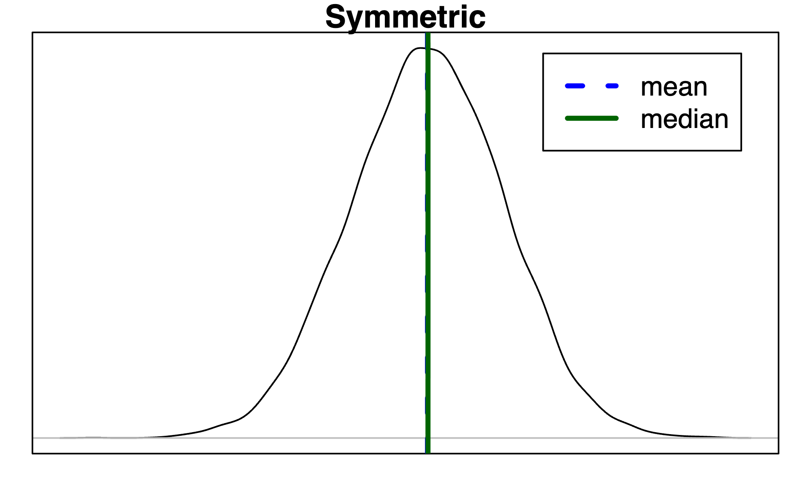{width=95%}
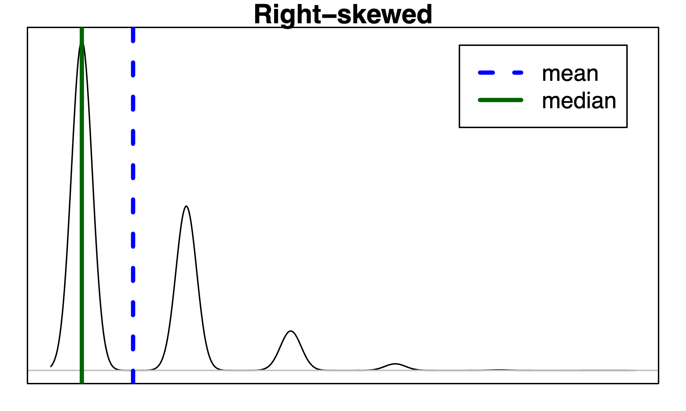{width=95%}
:::
:::

> If you wanted to estimate the *typical* household income for a student, would you be more interested in the mean or the median?

. . .

**Median** — it's not pulled around by a few very high (or low) incomes.

# Continuous distributions

## From histograms to density curves

So far, every distribution we've looked at has been a histogram — data grouped into bins. As the sample size grows and the bins shrink, the histogram's shape approaches a smooth curve called a **density curve**.

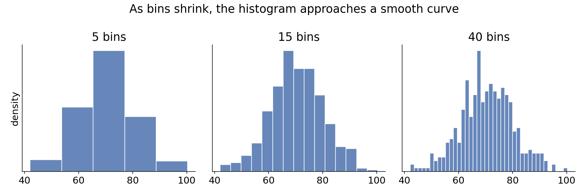{width=95% fig-align="center"}

A density curve is how we describe the distribution of a **continuous** random variable — one that can take any real value, not just discrete counts.

## Density curves: area = probability

For a continuous random variable, we can't ask "what's the probability of exactly this value?" (that probability is essentially zero). Instead:

- The **total area** under a density curve equals 1.
- The probability that $X$ falls in some range is the **area under the curve** over that range.

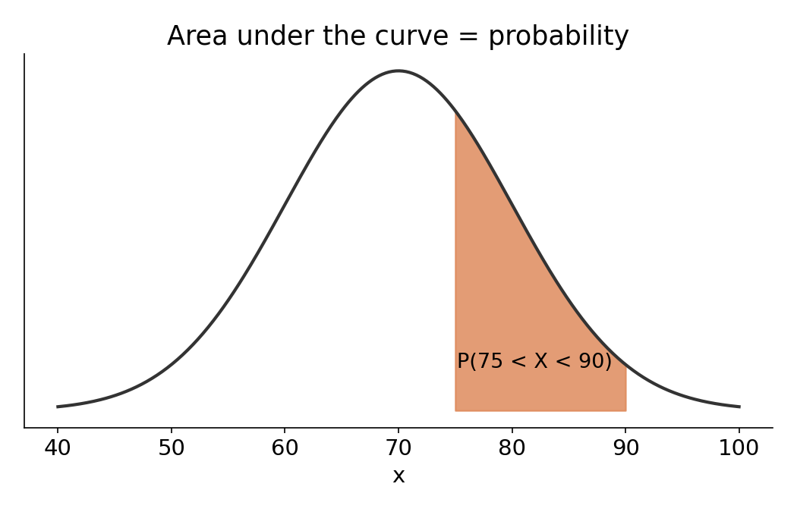{width=65% fig-align="center"}

## The normal distribution

The **normal distribution** is the most important continuous distribution — many real-world variables (heights, test scores, measurement errors) are approximately normal.

- Symmetric, bell-shaped, single peak.
- Fully described by two parameters: the mean $\mu$ (center) and standard deviation $\sigma$ (spread).

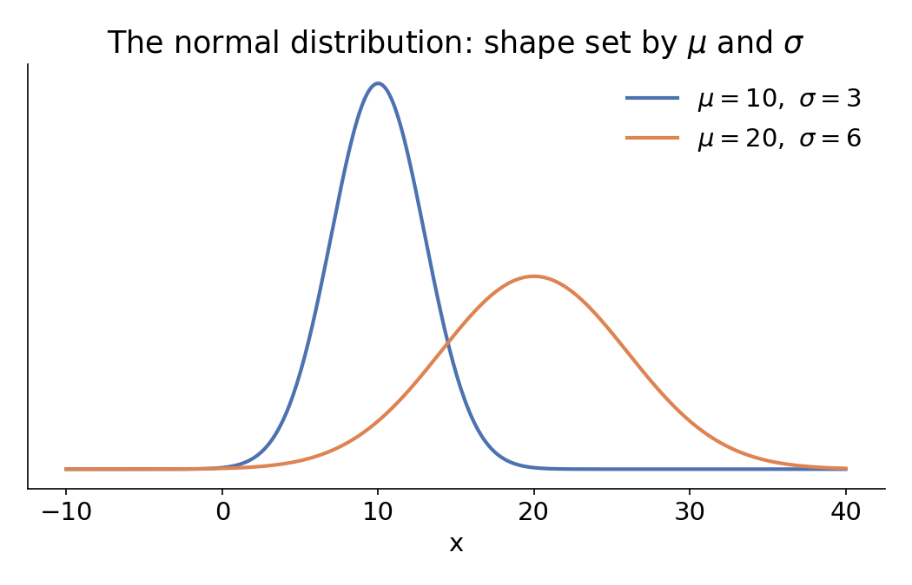{width=70% fig-align="center"}

## The 68-95-99.7 rule

For any normal distribution:

- About **68%** of values fall within 1 SD of the mean.
- About **95%** fall within 2 SD.
- About **99.7%** fall within 3 SD.

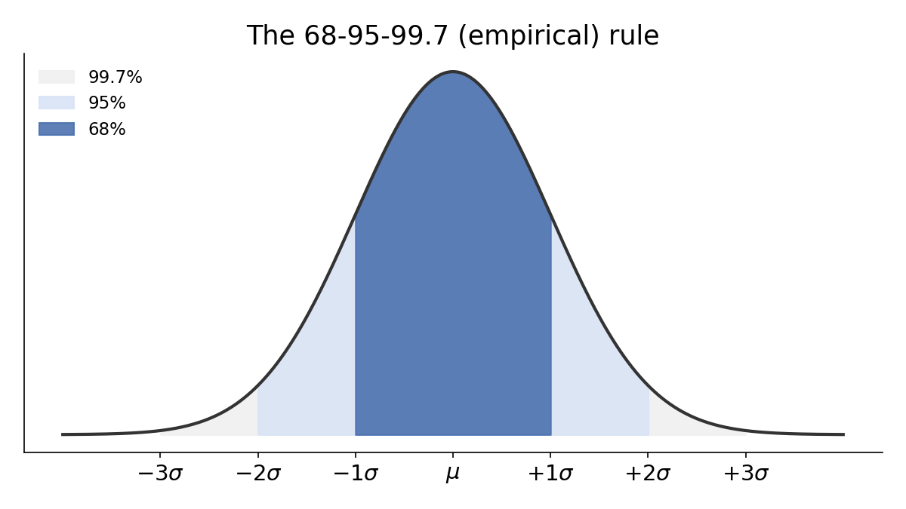{width=80% fig-align="center"}

## Using the normal model

> Suppose SAT math scores are approximately normal with $\mu = 500$ and $\sigma = 100$. What percent of students score between 400 and 600?

. . .

400 and 600 are exactly 1 SD below and above the mean — so by the 68-95-99.7 rule, about **68%** of students fall in that range.

. . .

> What percent score above 700?

. . .

700 is 2 SD above the mean. About 95% fall within $\pm 2\sigma$, leaving 5% split between the two tails — so about **2.5%** score above 700.

## Tying it together

- Monday, we described **categorical** data (bar plots, proportions) and built **discrete** probability distributions from countable outcomes.
- Today, we described **numerical** data (histograms, mean, SD, shape) and saw that as data become dense and continuous, that same shape becomes a **density curve**.
- The normal distribution lets us go from "here's what our sample's histogram looks like" to "here's a probability model we can use to answer questions about values we haven't observed."

Friday: we'll build these same summaries and plots in code.
