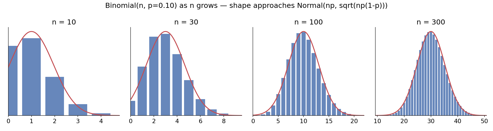
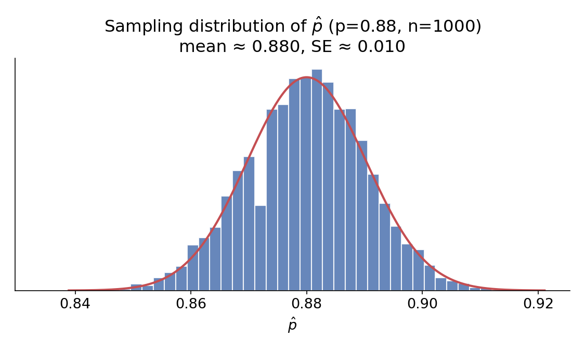
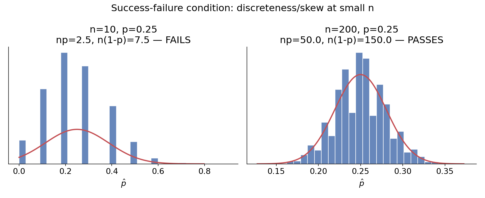

## Recap: discrete vs. continuous random variables

- A **discrete** random variable takes a countable set of values (often integers).
- A **continuous** random variable takes any value in an interval.

Today we go deeper on the discrete side, using one running example throughout, then bridge back to the normal distribution we already know.

## The Milgram experiment

Stanley Milgram (Yale, 1963) studied obedience to authority: an experimenter orders a "teacher" to shock a "learner" every time the learner answers incorrectly. (The shocks weren't real — the learner was an actor.)

- Milgram found about **65%** of people would obey and administer the shock.
- Equivalently, **35%** refused.

::: {.callout-note title="Bernoulli random variable"}
Think of each participant as one trial with two outcomes. Call it a **success** if the person *refuses* to shock — so $p = 0.35$.
:::

## The geometric distribution

> Dr. Smith wants to repeat this experiment, but only wants to sample people until she finds the **first** one who refuses. What's the probability she stops after the 1st person? The 3rd? The 10th?

- $P(\text{1st person refuses}) = 0.35$
- $P(\text{1st, 2nd shock; 3rd refuses}) = 0.65 \times 0.65 \times 0.35 \approx 0.15$
- $P(\text{9 shock; 10th refuses}) = 0.65^9 \times 0.35 \approx 0.0072$

::: {.callout-note title="Geometric distribution"}
Describes the waiting time until the first success in independent, identically distributed (iid) Bernoulli trials:
$$P(\text{success on the } n\text{th trial}) = (1-p)^{n-1}p$$
:::

## Practice

> Can we find the probability of rolling a 6 for the *first* time on the 6th roll of a die using the geometric distribution?

Yes — rolling a 6 is a clean success/failure outcome, one or the other happens every roll:

$$P(\text{6 on 6th roll}) = \left(\frac{5}{6}\right)^5 \left(\frac{1}{6}\right) \approx 0.067$$

## Expected value of a geometric distribution

> How many people is Dr. Smith expected to test before finding the first one who refuses?

$$\mu = \frac{1}{p} = \frac{1}{0.35} = 2.86$$

She's expected to test **2.86 people** — which raises a fair question: how can she test a non-whole number of people? (Answer: this is a long-run average, not a prediction about any one attempt.)

$$\sigma = \sqrt{\frac{1-p}{p^2}} = \sqrt{\frac{1-0.35}{0.35^2}} \approx 2.3$$

She's expected to test 2.86 people, give or take 2.3.

## The binomial distribution: setup

> Suppose we randomly select **4** individuals for the experiment. What's the probability that **exactly 1** refuses to shock?

Call them Allen, Brittany, Caroline, Damian. Four different orderings satisfy "exactly 1 refuses":

| Scenario | A | B | C | D | Probability |
|---|:---:|:---:|:---:|:---:|:---:|
| 1 | refuse | shock | shock | shock | $0.35 \times 0.65^3 = 0.0961$ |
| 2 | shock | refuse | shock | shock | $0.0961$ |
| 3 | shock | shock | refuse | shock | $0.0961$ |
| 4 | shock | shock | shock | refuse | $0.0961$ |

Total: $4 \times 0.0961 = 0.3844$.

## Counting scenarios without listing them all

Listing every ordering gets unmanageable fast — imagine $n=9$, $k=2$ refusals: `RRSSSSSSS`, `SRRSSSSSS`, `SSRRSSSSS`, ... far too many to enumerate by hand.

::: {.callout-note title="The choose function"}
The number of ways to get exactly $k$ successes in $n$ trials:
$$\binom{n}{k} = \frac{n!}{k!(n-k)!}$$
:::

- $\binom{4}{1} = 4$ — matches our hand count above.
- $\binom{9}{2} = 36$ — would've taken a while to list by hand! (In R: `choose(9, 2)`.)

## The binomial formula

::: {.callout-note title="Binomial distribution"}
The probability of exactly $k$ successes in $n$ independent Bernoulli trials, each with success probability $p$:
$$P(k \text{ successes in } n \text{ trials}) = \binom{n}{k} p^k (1-p)^{n-k}$$
:::

**Conditions required:** trials are independent; $n$ is fixed in advance; each trial is success/failure; $p$ is the same for every trial.

## Practice: Gallup obesity survey

> A 2012 Gallup survey found 26.2% of Americans are obese. Among a random sample of 10 Americans, what's the probability that **exactly 8** are obese?

$$P(X=8) = \binom{10}{8}(0.262)^8(0.738)^2 = 45 \times (0.262)^8 \times (0.738)^2 \approx 0.0005$$

Pretty low — makes sense, since 8-out-of-10 is far from the ~2.6-out-of-10 we'd expect.

## Expected value and variability

> Among 100 randomly sampled Americans, how many would you expect to be obese?

$$\mu = np = 100 \times 0.262 = 26.2$$

$$\sigma = \sqrt{np(1-p)} = \sqrt{100 \times 0.262 \times 0.738} \approx 4.4$$

We'd expect 26.2 out of 100 to be obese, give or take 4.4 — even though 26.2 isn't a number of people that can literally occur in any single sample.

## Unusual observations

Recall: observations more than 2 SD from the mean are considered unusual.

$$26.2 \pm (2 \times 4.4) = (17.4, 35)$$

**Practice:** A Gallup poll found 13% of Americans think home-schooling provides an excellent education. Would a sample of 1,000 people with only 100 sharing this view be unusual?

$$\mu = 1000(0.13) = 130, \qquad \sigma = \sqrt{1000(0.13)(0.87)} \approx 10.6$$

$$Z = \frac{100 - 130}{10.6} \approx -2.83$$

Yes — more than 2 SD below the mean, so unusual.

## What happens to the shape as $n$ grows?

{width=95% fig-align="center"}

At $n=10$, $p=0.10$, the distribution is noticeably right-skewed. By $n=300$, it's nearly symmetric and bell-shaped.

## How large is "large enough"?

::: {.callout-note title="Condition for the normal approximation"}
The sample size is large enough to approximate a binomial with a normal distribution when **both**:
$$np \ge 10 \qquad \text{and} \qquad n(1-p) \ge 10$$
:::

Check: for $n=10, p=0.13$: $np = 1.3$ — **fails**, too skewed to approximate. For $n=25, p=0.45$: $25(0.45)=11.25$ and $25(0.55)=13.75$ — **passes**.

## Facebook power users

A Pew study found Facebook users "get more than they give" (more friend requests received than sent, more likes received than given, etc.) — explained by **power users** who contribute disproportionately more content.

~25% of users are power users; the average user has 245 friends.

> What's the probability that the average user (245 friends) has **70 or more** power-user friends?

Directly: $P(X \ge 70) = P(X=70) + P(X=71) + \cdots + P(X=245)$ — a lot of binomial terms to add up.

## Solving it with the normal approximation

$n = 245$, $p = 0.25$. Check conditions: $np = 61.25 \ge 10$ ✓, $n(1-p) = 183.75 \ge 10$ ✓.

$$\mu = 245(0.25) = 61.25, \qquad \sigma = \sqrt{245(0.25)(0.75)} \approx 6.78$$

$$\text{Bin}(245, 0.25) \approx N(61.25,\ 6.78)$$

$$Z = \frac{70 - 61.25}{6.78} \approx 1.29 \qquad P(Z > 1.29) \approx 0.0985$$

In R: `1 - pnorm(1.29)`. About a 9.85% chance — much easier than summing 176 binomial terms by hand.

## A word of caution

The normal approximation can break down on **small, precise intervals** (e.g., approximating $P(X = 70)$ exactly), even when $np \ge 10$ and $n(1-p) \ge 10$ hold.

- Fix: extend the cutoff by **0.5 in each direction** (a **continuity correction**) when estimating a range of counts.
- This matters most for narrow ranges; for wide tail areas like the Facebook example, the correction barely changes the answer.

## Why this matters going forward

A **sample proportion** $\hat{p}$ is really a rescaled binomial count — successes divided by $n$. Because binomial counts are approximately normal for large $n$, sample proportions are too. That idea is worth its own section.

# Point estimates and the Central Limit Theorem

## Point estimates and error

Polling organizations like Pew Research survey samples to estimate opinions of an entire population.

- The unknown population value (e.g., true approval rating) is called the **parameter**, often denoted $p$.
- Our sample-based estimate is the **point estimate**, denoted $\hat{p}$ ("p-hat").
- The gap between them is **error**, made up of two parts:
  - **Sampling error** (a.k.a. sampling variability): how much $\hat{p}$ naturally bounces around from sample to sample.
  - **Bias**: a *systematic* tendency to over- or under-estimate — e.g., from a leading survey question. Good data collection minimizes this; it's not something a bigger sample fixes.

## Understanding sampling variability

> Suppose the true proportion of American adults who support expanding solar energy is $p = 0.88$. If we poll 1000 people, how close would we expect $\hat{p}$ to land to 0.88?

We can simulate this on a computer — draw a random sample of 1000 "adults" from a population where 88% support solar, and compute $\hat{p}$. Repeat 10,000 times:

{width=75% fig-align="center"}

## Describing the sampling distribution

This distribution of $\hat{p}$ values across simulated samples is called the **sampling distribution**.

- **Center:** essentially $p = 0.88$ — the sampling process is unbiased.
- **Spread:** the standard deviation of this distribution has a special name — the **standard error**, $SE_{\hat{p}}$.
- **Shape:** symmetric, bell-shaped — it *resembles a normal distribution*.

That resemblance isn't a coincidence — it's a general principle.

## The Central Limit Theorem

::: {.callout-note title="Central Limit Theorem (for a proportion)"}
When observations are independent and the sample size is sufficiently large, $\hat{p}$ follows an approximately normal distribution:
$$\mu_{\hat{p}} = p, \qquad SE_{\hat{p}} = \sqrt{\frac{p(1-p)}{n}}$$
"Sufficiently large" means the **success-failure condition**: $np \ge 10$ and $n(1-p) \ge 10$.
:::

Notice: this is the *exact same condition* we used for the normal approximation to the binomial — because $\hat{p}$ is just a rescaled binomial count.

## Applying the CLT to real poll data

Pew's actual solar-energy poll: $n = 1000$, observed $\hat{p} = 0.887$ (we don't know the true $p$ — that's the whole point of polling!).

- **Independence:** simple random sample ✓
- **Success-failure condition:** since we don't know $p$, substitute $\hat{p}$ (called the **plug-in principle**):
$$n\hat{p} = 1000(0.887) = 887 \ge 10, \qquad n(1-\hat{p}) = 113 \ge 10 \quad \checkmark$$

$$SE_{\hat{p}} \approx \sqrt{\frac{0.887(1-0.887)}{1000}} \approx 0.010$$

The CLT applies — we can model $\hat{p}$ as approximately $N(0.887, 0.010)$.

## Using the normal model for $\hat{p}$

> Using $N(\mu_{\hat p} = 0.88, SE_{\hat p} = 0.010)$: what fraction of samples would give $\hat{p}$ between 0.86 and 0.90?

$$Z_{0.86} = \frac{0.86 - 0.88}{0.010} = -2, \qquad Z_{0.90} = \frac{0.90-0.88}{0.010} = 2$$

Tail areas are each 0.0228, so the area between is $1 - 2(0.0228) = 0.9544$.

**About 95.4%** of samples of size 1000 would give a $\hat{p}$ within 0.02 of the true proportion — this is exactly the logic behind a margin of error.

## When the success-failure condition fails

$p = 0.25$, but now with $n=10$ (fails: $np=2.5$) vs. $n=200$ (passes: $np=50$):

{width=95% fig-align="center"}

At small $n$, $\hat{p}$ can only take a few discrete values (multiples of $1/n$) and the distribution is visibly skewed — the normal curve is a poor fit. The larger $n$ gets, the smoother and more symmetric it becomes.

## Looking ahead

- The sampling-distribution idea isn't limited to proportions — the same logic extends to sample **means**, differences in proportions, differences in means, and beyond. The details change; the core idea (a statistic has its own distribution, centered near the truth, with a quantifiable spread) doesn't.
- Next week: **randomization** gives us another way to quantify this same kind of uncertainty — one that doesn't require the success-failure condition, normality, or any of today's formulas at all.

