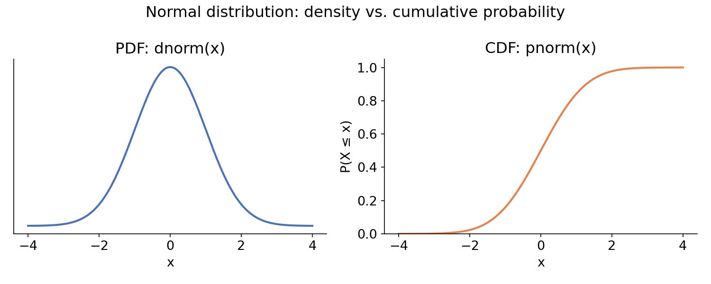
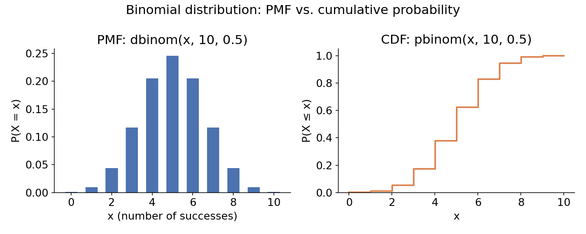
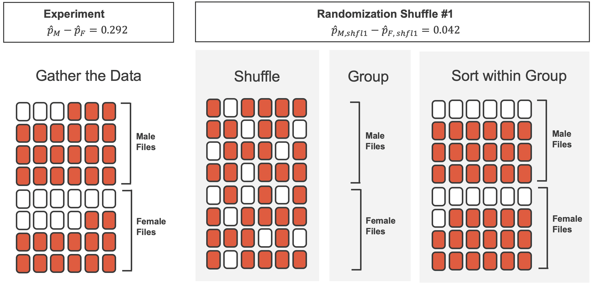
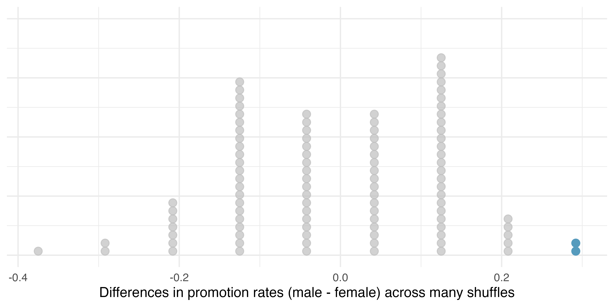
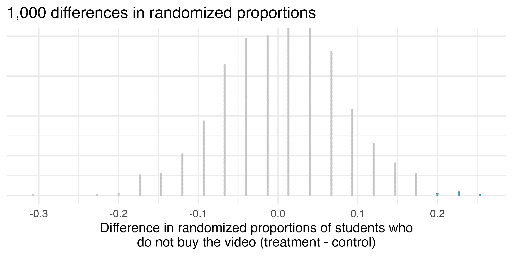
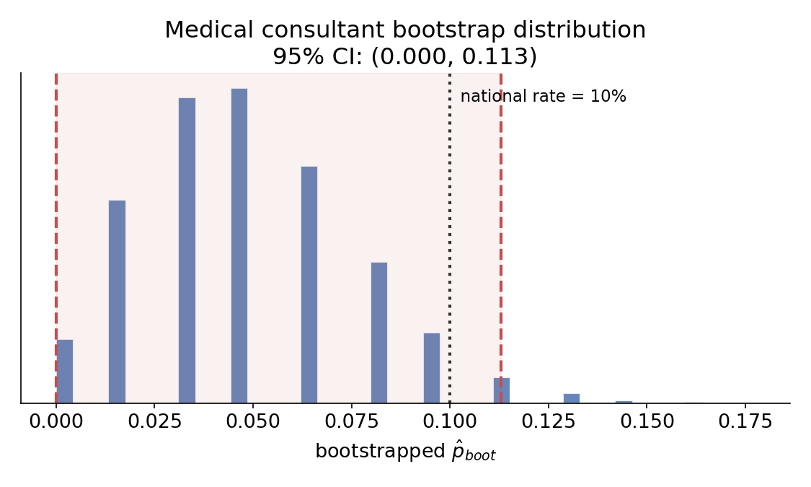

# Quick review: probability rules

## Probability rules, revisited

A fast refresher before we build on these ideas today.

- **Complement rule:** $P(A^c) = 1 - P(A)$ — the probability an event does *not* happen.
- **General addition rule:** $P(A \cup B) = P(A) + P(B) - P(A \cap B)$ — subtract the overlap so it isn't double-counted.
- **Independence:** $A$ and $B$ are independent if $P(A \cap B) = P(A) \times P(B)$ — equivalently, $P(A \mid B) = P(A)$.

## Conditional probability & Bayes' theorem

- **Conditional probability:**
$$P(A \mid B) = \frac{P(A \cap B)}{P(B)}$$

- **Bayes' theorem** flips the direction of a conditional probability — useful when you know $P(A \mid B)$ but want $P(B \mid A)$:
$$P(B \mid A) = \frac{P(A \mid B)\,P(B)}{P(A \mid B)\,P(B) + P(A \mid B^c)\,P(B^c)}$$

We'll lean on **independence** heavily today — the null hypothesis in both of today's case studies is a claim that two variables are independent.

## PDF vs. CDF

Recall from last time: a **density curve** describes how probability is distributed across values.

- **PDF (probability density function):** $f(x)$. In the discrete case, $f(x) = P(X = x)$ exactly. In the continuous case, $f(x)$ is a *density* — the probability of any single exact value is 0, so we only get probabilities from areas.
- **CDF (cumulative distribution function):** $F(x) = P(X \le x)$ — the running total of probability *up to* $x$. This works the same way for both discrete and continuous random variables.

## The normal distribution: PDF vs. CDF

{width=95% fig-align="center"}

In R: `dnorm(x)` gives the height of the density curve at $x$; `pnorm(x)` gives the area to the left of $x$ — i.e., $P(X \le x)$.

## The binomial distribution: PMF vs. CDF

{width=95% fig-align="center"}

Same idea, discrete version: `dbinom(x, n, p)` gives $P(X = x)$ exactly; `pbinom(x, n, p)` gives $P(X \le x)$, the running total.

# Hypothesis testing with randomization

## Where does variability come from?

Suppose your instructor splits the class into students sitting on the **left** vs. **right** side of the room, and asks who prefers reading books on a screen.

> If $\hat{p}_L$ and $\hat{p}_R$ are the proportions who prefer screens on each side, would you be surprised if $\hat{p}_L \ne \hat{p}_R$ exactly?

. . .

Almost certainly not — we'd expect some difference just from **chance**, even if seating side has *nothing* to do with reading preference. The hard question in statistics is: **how do we tell a "real" difference apart from one that's just chance?**

## Case study 1: Sex discrimination

**Research question:** Are individuals who identify as female discriminated against in promotion decisions?

48 male bank supervisors were each given an identical personnel file and asked whether to promote the candidate — except half the files were randomly labeled "male," half "female." (Rosen & Jerdee, 1974)

|        | Promoted | Not promoted | Total |
|--------|:---:|:---:|:---:|
| Male   | 21 | 3  | 24 |
| Female | 14 | 10 | 24 |
| Total  | 35 | 13 | 48 |

Promotion rate: **87.5%** (male) vs. **58.3%** (female) — a difference of **29.2 percentage points**.

## Setting up the hypotheses

The 29.2% gap is a **point estimate** of a real difference — but the sample is small. Is this discrimination, or could it just be chance?

- $H_0$ (**null hypothesis**): `sex` and `decision` are independent — the 29.2% gap is due to natural variability.
- $H_A$ (**alternative hypothesis**): `sex` and `decision` are *not* independent — female candidates are discriminated against.

The null hypothesis usually represents a **"no difference"** starting point. We only abandon it (reject!) if the data conflict with it strongly.

## The key idea: randomization

If $H_0$ is true, promotion had nothing to do with the sex on the file — so it wouldn't matter *how* the files got split into "male" and "female" piles.

**So let's simulate that.** Shuffle all 48 files (35 marked promoted, 13 not) together, and deal them into two new piles of 24 — pretending we relabeled them at random.

| (one simulated shuffle) | Promoted | Not promoted | Total |
|--------|:---:|:---:|:---:|
| "Male"   | 18 | 6  | 24 |
| "Female" | 17 | 7  | 24 |

Simulated difference: $18/24 - 17/24 = 0.042$ — much smaller than the real 29.2%.

## Visualize a Simulated Difference
{width=80% fig-align="center"}


## Repeating the shuffle, thousands of times

One shuffle isn't enough — we need to see the *whole range* of differences chance alone could produce. Repeating this over and over builds a **null distribution**: what the difference in promotion rates looks like when sex truly has no effect.

{width=80% fig-align="center"}

## From simulation to conclusion

Out of thousands of simulated (fake) reshuffles, only about **2.4%** produced a difference as extreme as the real 29.2%.

- If $H_0$ is true: we just observed something that would only happen about 2 times in 100 — pretty rare.
- If $H_A$ is true: female candidates are discriminated against, which is exactly why we'd see such a large gap.

Since a gap this large is rare under $H_0$, we **reject the null hypothesis** — the data provide strong evidence of discrimination.

## Case study 2: Opportunity cost

**Research question:** Does reminding college students that unspent money can be saved for later purchases reduce impulse buying?

150 students were shown a $14.99 video and asked whether they'd buy it. The **treatment** group's option added a reminder: *"...Not buy this video. Keep the \$14.99 for other purchases."*

|           | Buy | Not buy | Total |
|-----------|:---:|:---:|:---:|
| Control   | 56  | 19  | 75  |
| Treatment | 41  | 34  | 75  |

Not-buy rate: **45.3%** (treatment) vs. **25.3%** (control) — a **20 percentage point** difference.

## Randomizing the opportunity cost study

$H_0$: the reminder has no effect on purchasing decisions. $H_A$: the reminder reduces the chance of buying.

Same idea: shuffle the 150 decisions (97 buy, 53 not-buy) and re-deal into two groups of 75, pretending group assignment was unrelated to the decision.

{width=80% fig-align="center"}

Only about **0.9%** of simulated shuffles produced a gap this large — even rarer than case study 1.

## Conclusion: opportunity cost

Because a 20-point gap is extremely rare under $H_0$ (roughly 1 in 100 times, if not less), we **reject the null hypothesis**.

Since this was a randomized **experiment** (not just an observational study), we can make a causal claim: reminding students about opportunity cost *causes* a reduction in impulse purchases.

## Formalizing: the hypothesis testing framework

- **Null hypothesis ($H_0$):** a skeptical claim of "no difference" or "no effect" — assumed true until the data convince us otherwise.
- **Alternative hypothesis ($H_A$):** the claim researchers usually set out to find support for — a real relationship or effect.

**The US court system analogy:** a defendant is presumed innocent ($H_0$) until evidence convinces the jury of guilt ($H_A$) beyond reasonable doubt. A "not guilty" verdict doesn't prove innocence — it just means the evidence wasn't convincing enough. Same with hypothesis testing: *failing to reject $H_0$ is not the same as proving $H_0$ true.*

## The p-value

The **test statistic** is the summary value we compute from the data (here, a difference in proportions) and track across simulations.

::: {.callout-note title="p-value"}
The probability of observing data at least as extreme as ours, **if the null hypothesis were true**.
:::

- Sex discrimination: p-value $\approx 0.02$
- Opportunity cost: p-value $\approx 0.006$–$0.009$

A small p-value means the observed data would be surprising under $H_0$ — which is evidence *against* $H_0$.

## Statistical discernibility (a.k.a. "significance")

We reject $H_0$ when the p-value falls below a pre-chosen threshold, $\alpha$ (the **discernibility** or **significance level**) — conventionally $\alpha = 0.05$.

- p-value $< \alpha$ → **statistically discernible** evidence against $H_0$ → reject $H_0$.
- p-value $\ge \alpha$ → not enough evidence to reject $H_0$ (this does **not** mean $H_0$ is proven true).

Careful: "statistically discernible" is a technical statement about the p-value crossing a threshold — it does **not** by itself tell you whether the effect is large or practically meaningful.

## The randomization test recipe

1. **Frame the question as hypotheses** — $H_0$ (no relationship/no effect) vs. $H_A$.
2. **Collect data** — an experiment if you want a causal claim; an observational study otherwise.
3. **Model the randomness under $H_0$** — shuffle/permute to build the null distribution.
4. **Analyze the data** — compute the p-value: how often does chance alone produce something this extreme?
5. **Form a conclusion** — reject or fail to reject $H_0$, and state it in plain language.

## A peek ahead: doing this in code

We did the "shuffle the cards" step by hand (well, by simulation) today. In R, that loop looks like this:

```r
# Sex discrimination: shuffle sex labels, recompute the difference, repeat
diffs <- replicate(1000, {
  shuffled <- sample(sex_discrimination$sex)
  # ... recompute difference in promotion rate for the shuffled groups
})

mean(diffs >= 0.292)   # simulated p-value
```

# Confidence intervals with bootstrapping

## From testing to estimating

Chapter 11 answered yes/no questions: *is there a real difference?* Today's question is different: *how big is it, actually?*

- Randomization (Ch. 11) models what happens under a **skeptical null** — good for testing a specific claim.
- **Bootstrapping** (Ch. 12) instead asks: given the one sample we have, what's a plausible **range** for the true population parameter?

Both are simulation-based. Neither requires the normal-approximation conditions from a few weeks ago.

## Case study: the medical consultant

A consultant who assists liver-donor surgery patients claims her clients have a lower complication rate than the national average of 10%. Of her **62** clients, **3** had complications.

$$\hat{p} = \frac{3}{62} \approx 0.048$$

> Is this strong evidence her work reduces complications?

Two issues: (1) this is **observational** data — even if her rate is lower, we can't claim her work *caused* it (confounders like patient wealth are possible); (2) $\hat{p}$ is just one estimate — how much would it vary if we could repeat this over and over?

## The bootstrap idea

We can't actually go collect thousands of new samples of 62 patients. Instead: treat the **sample itself as a stand-in for the population**, and resample *from it*.

::: {.callout-note title="Bootstrap sample"}
A sample of the same size as the original, drawn **with replacement** from the original data.
:::

Think of her 62 clients as 62 marbles in a bag (3 red = complication, 59 white = no complication). Draw 62 marbles **with replacement** (so the same marble can be drawn more than once), and compute the resample's proportion, $\hat{p}_{boot}$. Repeat thousands of times.

## The bootstrap distribution

{width=85% fig-align="center"}

The bootstrapped proportions range from 0 to about 0.113. This spread tells us how much $\hat{p}$ would plausibly bounce around if we could resample.

## Building the confidence interval

::: {.callout-note title="95% bootstrap percentile confidence interval"}
Sort all the bootstrapped $\hat{p}_{boot}$ values. The 95% CI is (2.5th percentile, 97.5th percentile) of that sorted list.
:::

For the medical consultant: **95% CI = (0%, 11.3%)**.

> Does this interval show her true complication rate is below the national 10% rate?

. . .

**No** — the interval *overlaps* 10%. Her true rate could plausibly be anywhere from 0% up to 11.3%, which includes values both above and below the national average. We can't conclude she's better than average from this data alone.

## A sharper example: tappers and listeners

A famous study: 120 "tappers" tap out a well-known tune; 120 "listeners" try to guess the song. Tappers *expected* about 50% of listeners to guess correctly. In reality, only **3 of 120** listeners guessed correctly.

$$\hat{p} = \frac{3}{120} = 0.025$$

Bootstrapping this the same way (marbles: 3 red, 117 white, resampled with replacement, 10,000 times) gives:

**95% CI = (0%, 5.83%)**

## Interpreting a decisive interval

> Do the data provide convincing evidence against the tappers' claim that 50% of listeners can guess the tune?

**Yes** — 50% isn't just outside the interval, it's *far* outside (0% to 5.83%). This is a much more decisive result than the medical consultant case, where the interval straddled the value in question.

**The general lesson:** whether a confidence interval is useful for testing a specific claim depends on whether that claimed value falls inside or clearly outside the interval — and *how far* outside, if it does.

## What is a confidence interval, really?

::: {.callout-note title="Confidence interval"}
A range of plausible values for an unknown population parameter.
:::

**Analogy:** a point estimate is like fishing with a spear — aim well, but you'll often miss. A confidence interval is like fishing with a net — cast a wide-enough area and you'll usually catch the fish.

- Report just $\hat{p}$: probably *not* exactly right.
- Report a range: good chance of capturing the true $p$.

> Want more certainty of capturing the parameter — do you use a wider or narrower interval?

. . .

**Wider** — a bigger net catches more, but is less precise about exactly where the fish is. This is the tradeoff behind choosing 90% vs. 95% vs. 99% confidence.

## The bootstrap process, summarized

1. **Frame the question in terms of a parameter to estimate** — not a yes/no claim this time.
2. **Collect data** — observational or experimental.
3. **Model the randomness by resampling the data itself, with replacement** — the sample stands in for the population.
4. **Build the interval** — pick a confidence level, take the corresponding percentiles of the bootstrap distribution.
5. **Form a conclusion** — state the interval in plain language, and note what it does (and doesn't) tell you.

## A peek ahead: bootstrapping in code

```r
# Medical consultant: resample WITH replacement, recompute p-hat, repeat
boot_props <- replicate(10000, {
  resample <- sample(consultant_data$outcome, size = 62, replace = TRUE)
  mean(resample == "complication")
})

quantile(boot_props, c(0.025, 0.975))   # 95% bootstrap CI
```

Notice the one-word difference from Chapter 11's code: `replace = TRUE` instead of a plain shuffle. Randomization permutes labels; bootstrapping resamples *with replacement* from the data itself — same simulate-many-times spirit, different question being asked.


