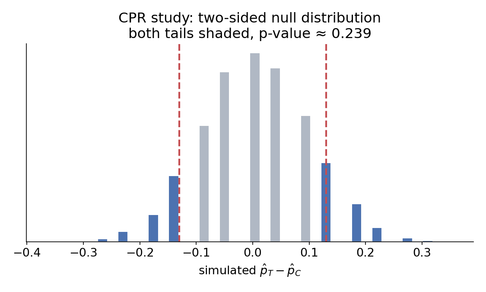
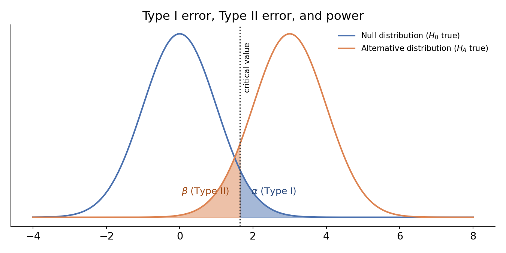

# Recap: from simulation to formula

## Where we've been

- **Ch. 11 (randomization):** simulate the null by shuffling/permuting.
- **Ch. 12 (bootstrapping):** simulate variability by resampling with replacement.
- **Today (Ch. 13):** the *same* conclusions, but using a mathematical formula (the normal distribution) instead of running thousands of simulations.

. . .

This works because of something you've already seen: the **Central Limit Theorem**. Sample proportions (and many other statistics) tend to follow a normal distribution when the sample is big enough and observations are independent.

## Notation recap

- A normal distribution with mean $\mu$ and standard deviation $\sigma$ is written $N(\mu, \sigma)$.

. . .

- The **standard normal distribution** is $N(0, 1)$.

. . .

- The **Z-score** standardizes any observation: $Z = \dfrac{x - \mu}{\sigma}$.

. . .

- **Standard error (SE):** the standard deviation of a *statistic's* sampling distribution (not of the raw data).

. . .

- **Margin of error:** $z^\star \times SE$ — how far, in a given direction, we expect a point estimate to land from the truth at a chosen confidence level. For 95% confidence, $z^\star = 1.96$.

## Z-score for a hypothesis test

::: {.callout-note title="Test statistic (Z)"}
$$Z = \frac{\text{point estimate} - \text{null value}}{SE}$$
:::

This is the exact same Z-score idea from individual observations — just applied to a *statistic* instead of a single data point. 

. . .

Once we have $Z$, we find the p-value the same way we always have: the tail area of $N(0,1)$ beyond $Z$.

## Case study: opportunity cost, revisited

Recall: observed difference in "not-buy" rate was 0.20. The best-fitting normal curve for the null distribution has mean 0 and $SE = 0.078$.

. . .

$$Z = \frac{0.20 - 0}{0.078} = 2.56 \qquad \Rightarrow \qquad p\text{-value} \approx 0.0052$$

. . .

Compare to the randomization p-value from Ch. 11: $\approx 0.006$. **Close agreement.**

## Case study: medical consultant, revisited

Recall: $\hat{p} = 3/62 = 0.048$; null value $p_0 = 0.10$; $SE = 0.038$.

. . .

$$Z = \frac{0.048 - 0.10}{0.038} = -1.37 \qquad \Rightarrow \qquad p\text{-value} \approx 0.0853$$

. . .

Compare to the bootstrap-based simulation p-value: $\approx 0.122$. **Noticeably different this time** — the null distribution here is visibly skewed, so the normal curve is a poor fit. Lesson: **always check conditions** before trusting the normal model.

## Building a confidence interval

::: {.callout-note title="95% confidence interval"}
$$\text{point estimate} \pm Z_{\alpha} \times SE$$
:::

$Z_\alpha$ comes directly from the standard normal distribution: the area between $Z_{2.5}=-1.96$ and $Z_{97.5}=1.96$ is exactly 0.95.

## Case study: the stent study

An experiment: does a brain stent reduce stroke risk after CPR? $n=451$ patients.

|           | No event | Stroke | Total |
|-----------|:---:|:---:|:---:|
| Control   | 214 | 13  | 227 |
| Treatment | 191 | 33  | 224 |

Point estimate: $\hat{p}_{trmt} - \hat{p}_{ctrl} = 0.090$ (surprising — stents look *worse*). Given $SE = 0.028$:

$$0.090 \pm 1.96 \times 0.028 = (0.035,\ 0.145)$$

. . .

Since this interval is entirely above 0, and this was a randomized **experiment**, we have convincing evidence the stent **caused** increased stroke risk.

## Interpreting confidence intervals correctly

::: {.callout-note title="Correct interpretation"}
We are 95% confident that the population parameter is between *lower* and *upper*.
:::

. . .

**Not correct:** "there's a 95% probability the parameter is in this interval" — the parameter isn't random; *our interval* is what varies from sample to sample.

. . .

Out of every 100 properly constructed 95% confidence intervals, we expect about 5 to miss the true parameter — not due to bad science, just natural sample-to-sample variability. A confidence interval only tries to capture the **population parameter** — it says nothing about individual observations.

## Practice: Z-scores

> Sophia scored 160 on the GRE Verbal section ($N(\mu=151, \sigma=7)$) and 157 on Quantitative ($N(\mu=153, \sigma=7.67)$). Which section did she do relatively better on?

. . .

$$Z_{Verbal} = \frac{160-151}{7} = 1.29 \qquad Z_{Quant} = \frac{157-153}{7.67} = 0.52$$
. . .

Her Verbal score is further above its mean (in SD units) — **relatively stronger on Verbal**, even though her raw Quant-adjacent score might look closer to "average" on a different scale.

## Practice: confidence interval

> A 2013 Pew poll found 45% of US adults report living with a chronic condition, with reported $SE \approx 1.2\%$. Construct and interpret a 95% CI.

. . .

$$0.45 \pm 1.96 \times 0.012 = (0.427,\ 0.473)$$
. . .

**Interpretation:** We are 95% confident that between 42.7% and 47.3% of US adults live with a chronic condition.

. . .
 
**Careful:** does this interval provide discernible evidence that a *minority* of US adults have a chronic condition (i.e., that the true proportion is below 50%)? Since the entire interval is below 0.50, yes.

# Decision errors

## Hypothesis tests can be wrong

Just like a court can convict an innocent person or free a guilty one, a hypothesis test can reach the wrong conclusion.

| Truth $\downarrow$ / Test says $\rightarrow$ | Reject $H_0$ | Fail to reject $H_0$ |
|---|:---:|:---:|
| $H_0$ true  | **Type I error** | Good decision |
| $H_A$ true  | Good decision | **Type II error** |

. . .

- **Type I error:** rejecting $H_0$ when it's actually true (a "false positive").

. . .

- **Type II error:** failing to reject $H_0$ when $H_A$ is actually true (a "false negative").

## Errors in context

> In the opportunity cost study, we rejected $H_0$ and concluded the reminder reduces spending. What would a Type I error mean here?

. . .

It would mean the reminder actually has **no effect**, and we happened to see a 20-point gap purely by chance — even though we concluded otherwise.

. . .

> How would we lower the Type I error rate in a court system? What happens to the Type II error rate?

. . .

Raise the standard of evidence (e.g., "beyond a reasonable doubt" → "beyond a conceivable doubt"). Fewer innocent people convicted (lower Type I) — but also harder to convict the truly guilty (**higher** Type II). **The two error rates trade off against each other.**

## The same idea, medical-testing language

Diagnostic testing uses its own vocabulary for these same two error rates — you'll see this constantly outside the classroom (medicine, spam filters, fraud detection).

| | Condition present ($H_A$ true) | Condition absent ($H_0$ true) |
|---|:---:|:---:|
| **Test positive** (reject $H_0$) | True positive — rate = **sensitivity** | False positive — rate = $\alpha$ (Type I) |
| **Test negative** (fail to reject $H_0$) | False negative — rate = $\beta$ (Type II) | True negative — rate = **specificity** |

## Testing Language

::: {.callout-note title="Sensitivity and specificity"}
**Sensitivity** = $P(\text{test positive} \mid \text{condition present})$ = true positive rate = $1-\beta$ = **power**.

**Specificity** = $P(\text{test negative} \mid \text{condition absent})$ = true negative rate = $1-\alpha$.
:::

. . .

A "highly sensitive" test rarely misses true cases (low Type II/false-negative rate). A "highly specific" test rarely flags healthy people (low Type I/false-positive rate) — exactly the same tradeoff as choosing $\alpha$.

## Why high accuracy can still mislead

Recall **Bayes' theorem** from our probability review

> A disease affects 1% of a population. A screening test has 90% sensitivity and 95% specificity. If someone tests positive, what's the probability they actually have the disease?

$$P(\text{disease} \mid +) = \frac{P(+ \mid \text{disease})\,P(\text{disease})}{P(+ \mid \text{disease})\,P(\text{disease}) + P(+ \mid \text{no disease})\,P(\text{no disease})}$$

$$= \frac{(0.90)(0.01)}{(0.90)(0.01) + (0.05)(0.99)} = \frac{0.009}{0.0585} \approx 0.154$$

## Interpreting the result

Even with a "90% accurate, 95% accurate" test, only about **15.4%** of people who test positive actually have the disease.

- This isn't a flaw in the test — it's a consequence of the disease being **rare**. With so few true cases, even a small false-positive rate ($\alpha=0.05$) among the huge healthy majority produces more false positives in absolute terms than true positives among the small diseased group.

. . .

- This is the same lesson as the discernibility-level discussion: the practical meaning of a positive result depends not just on the test's error rates, but on the **context** — here, how common the condition is to begin with.

. . . 

- This is also exactly why we conditioned on the *right* thing back in Ch. 12's medical consultant example — direction of conditioning matters, and it's easy to accidentally answer $P(+ \mid \text{disease})$ when the question actually asked for $P(\text{disease} \mid +)$.

## Choosing a discernibility level ($\alpha$)

The traditional default is $\alpha = 0.05$, but it's not sacred — it should reflect the real-world cost of each error type.

. . .

- If a **Type I error is dangerous or costly** (e.g., approving an ineffective/harmful drug), use a *smaller* $\alpha$ (0.01, 0.001) — demand stronger evidence before rejecting $H_0$.

. . .

- If a **Type II error is more dangerous** (e.g., missing a real safety issue), use a *larger* $\alpha$ (0.10) — don't require as much evidence.

## One-sided vs. two-sided hypotheses

- **One-sided test:** $H_A$ specifies a direction (e.g., $p_T - p_C > 0$). Appropriate only when we truly care about just one direction, decided *before* seeing the data.
- **Two-sided test:** $H_A$ allows *either* direction ($p_T - p_C \ne 0$). This is the **default**, safer choice — keep an open mind.

::: {.callout-note title="Default to two-sided"}
Use a one-sided test only if you have genuine, pre-specified interest in just one direction.
:::

## Case study: CPR and blood thinners

Does a blood thinner affect survival after CPR? $H_0: p_T - p_C = 0$ vs. $H_A: p_T - p_C \ne 0$ (two-sided, since a thinner could plausibly help *or* hurt).

|           | Died | Survived | Total |
|-----------|:---:|:---:|:---:|
| Control   | 39  | 11 | 50 |
| Treatment | 26  | 14 | 40 |

$\hat{p}_C = 11/50 = 0.22$, $\hat{p}_T = 14/40 = 0.35$, observed difference $= 0.13$.

## Computing a two-sided p-value

{width=80% fig-align="center"}

A difference of $-0.13$ would be *equally* strong evidence for $H_A$ as $+0.13$ — so both tails count.

::: {.callout-note title="Two-sided p-value"}
Compute the one-tail area, then **double it**.
:::

One tail $\approx 0.13$; doubled $\approx 0.26$. Since $0.26 > 0.05$, we **fail to reject** $H_0$ — no convincing evidence the blood thinner affects survival.

## Never switch sides after seeing the data

> Using $\alpha = 0.05$: what happens if we always pick whichever one-sided test matches the direction the data happen to point?

If the true difference is 0, about 5% of the time the sample difference lands high enough to reject with $H_A: \text{diff} > 0$, and *separately* about 5% of the time it lands low enough to reject with $H_A: \text{diff} < 0$.

$$\text{True Type I error rate} = 5\% + 5\% = 10\% \ne 5\%$$

**Hypotheses must be set up *before* looking at the data** — otherwise your real error rate silently doubles.

## Power

::: {.callout-note title="Power"}
The probability of correctly rejecting $H_0$ when $H_A$ is actually true.
:::

{width=85% fig-align="center"}

- $\alpha$ = Type I error rate (area in the null distribution's tail).
- $\beta$ = Type II error rate (area in the alternative distribution overlapping the "fail to reject" region).
- **Power** $= 1 - \beta$.

## What affects power?

- **Effect size:** a bigger true difference between groups is easier to detect (the two curves above overlap less).

. . .

- **Sample size:** larger $n$ shrinks $SE$, which narrows *both* distributions — less overlap, more power.

. . .

- **Discernibility level:** a larger $\alpha$ increases power but also increases the Type I error rate — the classic tradeoff.

. . .

A well-designed study picks a sample size *in advance* large enough to have good power to detect an effect size that would actually matter.

## Closing example: a real COVID-19 test

A 2024 study ([Madewell et al., *Influenza and Other Respiratory Viruses*](https://pmc.ncbi.nlm.nih.gov/articles/PMC11300111/#irv13305-sec-0009)) evaluated the Abbott BinaxNOW rapid antigen card against RT-PCR in Puerto Rico:

> If you took this test today and it came back **positive**, what's the probability you actually have COVID? What if it came back **negative**?

. . .

Paper says $$\text{Sensitivity} = 84.1\%, \qquad \text{Specificity} = 98.8\%$$

What else do you need to know?

. . .

The catch: the answer depends on something the test itself can't tell you — how common the disease is **right now**, in your community ($P(\text{disease})$). Let's see why that matters.

## Same test, three prevalence scenarios

Using Bayes' theorem with $Se=0.841$, $Sp=0.988$, at three different community prevalence levels: (low) 2%, (moderate) 5%, and (outbreak) 20%, what would be the probability you have the disease given your tested positive (and negative)?

$$P(\text{disease} \mid +) = \frac{P(+ \mid \text{disease})\,P(\text{disease})}{P(+ \mid \text{disease})\,P(\text{disease}) + P(+ \mid \text{no disease})\,P(\text{no disease})}$$
**Sensitivity** = $P(\text{test positive} \mid \text{condition present})$ = true positive rate = $1-\beta$ = **power**.

**Specificity** = $P(\text{test negative} \mid \text{condition absent})$ = true negative rate = $1-\alpha$.

## Answers

| Community prevalence | $P(\text{disease}\mid +)$ | $P(\text{disease}\mid -)$ |
|:---:|:---:|:---:|
| 2% (low transmission) | 58.9% | 0.33% |
| 5% (moderate) | 78.7% | 0.84% |
| 20% (active outbreak) | 94.6% | 3.87% |

- A **positive** result means something very different depending on how much virus is circulating — from "better than a coin flip either way" at low prevalence to "almost certainly infected" during an outbreak.
- A **negative** result is reassuring in *every* scenario (all under 4%) — but even that reassurance weakens as background prevalence rises, since the test's 15.9% false-negative rate ($1-Se$) has more true cases to miss from.

. . .

**The takeaway:** the same test, with fixed sensitivity and specificity, gives genuinely different real-world information depending on context — which is exactly why public health guidance around testing changes over the course of an outbreak, even when the test itself hasn't changed at all.

## Wrapping up

- Mathematical models (Ch. 13) give the *same* conclusions as simulation (Ch. 11-12) when conditions hold — and are much faster to compute — but they can fail silently when conditions (independence, large-enough $n$) aren't checked.
- Every hypothesis test risks two kinds of mistakes (Type I, Type II) — and reducing one generally increases the other.
- Default to **two-sided** tests unless you have a genuine, pre-specified reason not to.
- **Power** — our ability to detect a real effect — depends on effect size, sample size, and $\alpha$, and is worth thinking about *before* collecting data, not after.
