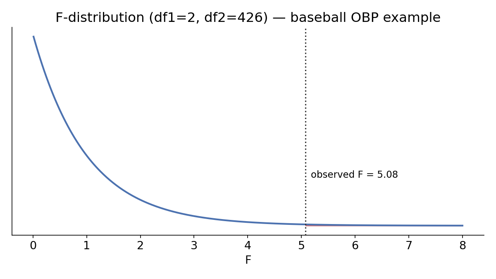

# Comparing two independent means

## Extending Chapter 19

Chapter 19 handled one mean. Now: two **independent** groups — different, unrelated individuals in each.

$$\text{Point estimate: } \bar x_1 - \bar x_2$$

Same three tools as always: randomization, bootstrapping, and the t-distribution mathematical model.

## Case study: two exam versions

An instructor gives two versions of an exam, shuffled randomly to students. Version B students worry theirs was harder.

| Exam | $n$ | Mean | SD |
|---|:---:|:---:|:---:|
| A | 58 | 75.1 | 13.9 |
| B | 55 | 72.0 | 13.8 |

$H_0: \mu_A - \mu_B = 0$ (equally difficult) vs. $H_A: \mu_A - \mu_B \ne 0$. Observed difference: $3.1$ points.

. . .

Randomizing exam labels 1,000 times: differences due to chance alone ranged from about $-10$ to $+10$ points — so 3.1 doesn't stand out much.

## A result worth sitting with

The randomization p-value comes out to about **0.2**. Using $\alpha = 0.01$ (chosen in advance): we **fail to reject $H_0$**.

. . .

This does **not** mean the exams are equally difficult — it means the data can't distinguish between "equally difficult" and "Exam A is a bit easier." Hypothesis testing is built to reject a claim, not to prove one. In this case, the teacher (and class) can be glad there's no evidence one exam was harder.

## Bootstrapping the difference: stem cells and heart function

Sheep with heart attacks, randomized to embryonic stem cell (ESC) treatment or control; outcome is change in heart pumping capacity.

| Group | $n$ | Mean | SD |
|---|:---:|:---:|:---:|
| ESC | 9 | 3.50 | 5.17 |
| Control | 9 | $-4.33$ | 2.76 |

Point estimate: $3.50 - (-4.33) = 7.83$.

. . .

Bootstrap each group separately (with replacement), subtract the means, repeat thousands of times — builds a confidence interval with **no null hypothesis assumed**.

## Interpreting the interval

Both the bootstrap percentile and bootstrap SE 90% intervals for $\mu_{ESC} - \mu_{Control}$ stay entirely **positive** — zero is nowhere close.

. . .

Since this was a randomized experiment, we conclude ESC treatment **causes** improved heart pumping capacity relative to control.

## The mathematical model: t-test for two means

::: {.callout-note title="T statistic for two independent means"}
$$T = \frac{(\bar x_1 - \bar x_2) - 0}{\sqrt{\dfrac{s_1^2}{n_1} + \dfrac{s_2^2}{n_2}}}, \qquad df = \min(n_1-1,\ n_2-1)$$
:::

**Conditions:** independent observations within and between groups; large samples with no extreme outliers (checked separately per group).

## Worked example: smoking and birth weight

Does maternal smoking relate to newborn birth weight? ($n=1000$ births sampled)

| Group | $n$ | Mean | SD |
|---|:---:|:---:|:---:|
| Nonsmoker | 867 | 7.27 | 1.23 |
| Smoker | 114 | 6.68 | 1.60 |

$\bar x_n - \bar x_s = 0.59$, $SE = \sqrt{1.23^2/867 + 1.60^2/114} = 0.16$.

$$T = \frac{0.59 - 0}{0.16} = 3.69, \qquad df = \min(866, 113) = 113$$

. . .

Two-sided p-value $\approx 0.00034$. Since $p < 0.05$, **reject $H_0$** — convincing evidence of a real difference in average birth weight.

# Comparing paired means

## When independence fails on purpose

Sometimes two measurements are **linked** by design: the same subject measured twice, or naturally matched pairs (same car, same textbook, same day).

::: {.callout-note title="Paired data"}
Two sets of observations are paired if each observation in one set corresponds to exactly one observation in the other.
:::

**The key move:** collapse each pair into a single number — its **difference** — and suddenly this is just a **one-sample** problem (Chapter 19) again.

## Case study: tire tread wear

25 cars, each fitted with one Smooth Turn tire and one Quick Spin tire. Mean tread: Quick Spin 0.308 cm, Smooth Turn 0.310 cm — a tiny raw difference.

$H_0: \mu_{diff}=0$ vs. $H_A: \mu_{diff}\ne0$.

. . .

**The randomization twist:** shuffle brand *within* each car (not across all 50 tires) — since if $H_0$ is true, it shouldn't matter which brand a given car's tire happened to be.

. . .

The observed difference falls **far outside** the randomization distribution (which ranges roughly $\pm0.0025$). We reject $H_0$ — the brands really do differ in average tread wear.

## Bootstrapping paired differences: textbook prices

201 UCLA courses sampled; 68 books found on both the UCLA Bookstore and Amazon. Treat each book's **price difference** (Bookstore $-$ Amazon) as a single data point.

| $n$ | Mean | SD |
|:---:|:---:|:---:|
| 68 | \$3.58 | \$13.4 |

. . .

Bootstrapping the 68 differences (with replacement) gives a 99% percentile CI of about (\$0.25, \$7.87) — suggesting the Bookstore tends to run higher, though the exact margins are uncertain.

## The t-test on differences

::: {.callout-note title="T statistic for paired means"}
$$T = \frac{\bar x_{diff} - 0}{s_{diff}/\sqrt{n_{diff}}}, \qquad df = n_{diff}-1$$
:::

For the textbook data: $SE = 13.42/\sqrt{68} = 1.63$, $T = 3.58/1.63 = 2.20$, $df=67$.

. . .

Two-sided p-value $\approx 0.031 < 0.05$ — reject $H_0$. 95% CI: $3.58 \pm 2.00(1.63) = (\$0.32, \$6.84)$ — the UCLA Bookstore is, on average, higher-priced than Amazon.

## A note on power

The paired t-test is often **more powerful** than the independent two-sample t-test — pairing removes a source of variability (person-to-person or item-to-item differences) that would otherwise inflate the standard error.

. . .

But pairing isn't always available — you need a real, natural correspondence between observations, not just equal sample sizes.

# Comparing many means: ANOVA

## Why not just run lots of two-group tests?

With 3+ groups, comparing every pair separately is tempting — but dangerous.

. . .

If you run enough pairwise comparisons, **you will eventually find "significance" somewhere just by chance**, even when nothing real is going on — this is **data snooping** / the **multiple comparisons problem**.

::: {.callout-note title="ANOVA (ANalysis Of VAriance)"}
A single, holistic test of whether *at least one* group mean differs — before you go looking for which one.
:::

$$H_0: \mu_1 = \mu_2 = \cdots = \mu_k \qquad H_A: \text{at least one } \mu_j \text{ differs}$$

## The core idea

ANOVA compares two kinds of variability:

- **MSG** (mean square between groups) — how much the group *means* differ from the overall mean.
- **MSE** (mean square error) — how much individual observations vary *within* each group.

$$F = \frac{MSG}{MSE}$$

. . .

If $H_0$ is true, both should be similar in size, so $F\approx1$. A big $F$ means the between-group differences are large *relative to* the natural noise within groups.

## Case study: baseball batting by position

Do on-base percentages (OBP) differ by fielding position?

| Position | $n$ | Mean | SD |
|---|:---:|:---:|:---:|
| OF | 160 | 0.320 | 0.043 |
| IF | 205 | 0.318 | 0.038 |
| C | 64 | 0.302 | 0.038 |

$MSG = 0.00803$, $MSE = 0.00158$, so $F = MSG/MSE \approx 5.08$.

## The F-distribution

::: {.callout-note title="F-test"}
$F$ follows an $F$-distribution with $df_1 = k-1$ (groups) and $df_2 = n-k$ (residual) when $H_0$ is true.
:::

{width=75% fig-align="center"}

## P-value

Here: $df_1 = 3-1=2$, $df_2 = 429-3=426$.

. . .

p-value $\approx 0.0066 < 0.05$ — **reject $H_0$**: average OBP genuinely varies by position. (ANOVA doesn't say *which* position differs — that requires careful follow-up, avoiding the multiple-comparisons trap.)

## Reading software output

|term|df|sumsq|meansq|statistic|p.value|
|---|:-:|:-:|:-:|:-:|:-:|
|position|2|0.0161|0.0080|5.08|0.0066|
|Residuals|426|0.6740|0.0016| | |

In R: `aov(OBP ~ position, data = mlb_players_18) %>% summary()` (or `anova(lm(...))`) produces exactly this table.

## Conditions for ANOVA

- **Independence** — within and across all groups.
- **Approximately normal** within each group (or large enough samples with no extreme outliers).
- **Constant variance** across groups — check with side-by-side boxplots; a red flag if one group's spread looks much larger than another's.

. . .

Notice ANOVA gives **no confidence interval** — there's no single "difference" parameter when comparing 3+ groups at once. For that, drop back down to Chapter 20's two-mean methods, applied carefully (not comparing every possible pair).

## Extending the exam example to three exams

Recall Exam A vs. B (Ch. 20) — now imagine a third version, Exam C:

| Exam | $n$ | Mean | SD |
|---|:---:|:---:|:---:|
| A | 58 | 75.1 | 13.9 |
| B | 55 | 72.0 | 13.8 |
| C | 51 | 78.9 | 13.1 |

$H_0: \mu_A=\mu_B=\mu_C$. Randomizing 1,000 times gives an observed $F=3.48$, with simulated p-value $\approx 0.036$.

. . .

Reject $H_0$ — some exam is genuinely different in difficulty. But careful: this doesn't mean Exam C specifically is harder — concluding that from eyeballing the means, after the fact, is exactly the data-snooping trap ANOVA exists to avoid.

## Wrapping up

- **Two independent means:** same $\bar x_1 - \bar x_2$ point estimate, same t-distribution logic as one mean — just a new SE formula combining both groups' variability.
- **Paired means:** the pairing structure lets you collapse two dependent measurements into one difference — turning a two-sample problem back into a one-sample problem, often with more power.
- **Many means (ANOVA):** a single test to check "is *any* group different?" before you go hunting for which one — protecting against inflated Type I error from multiple comparisons.
- All three still rest on the same foundation from Ch. 11-14: a point estimate, a measure of its natural variability, and a way to ask "could chance alone explain what we're seeing?"
