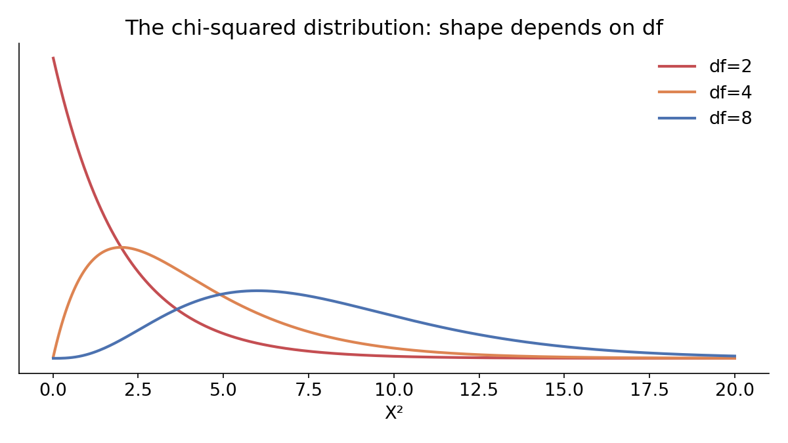

# Inference for two-way tables

## Beyond two groups

Chapter 17 compared proportions across **two** groups. But what if a variable has **three or more** categories on either side?

> Researchers had 219 participants sell a used iPod (known to have frozen twice) to a buyer who asked one of three questions: a **general** question, a **positive-assumption** question ("it doesn't have problems, does it?"), or a **negative-assumption** question ("what problems does it have?"). Did the question asked affect whether the seller disclosed the freezing issue?

. . .

With 3 categories on one side, "the difference in proportions" no longer has a single, obvious meaning — we need a new tool.

## The data

| Question | Disclosed | Hid | Total |
|---|:---:|:---:|:---:|
| General | 2 | 71 | 73 |
| Positive assumption | 23 | 50 | 73 |
| Negative assumption | 36 | 37 | 73 |
| Total | 61 | 158 | 219 |

$H_0$: the question asked and disclosure are **independent**. $H_A$: they are **not** independent.

. . .

The disclosure rates look very different across rows (2.7%, 31.5%, 49.3%) — but is that a real effect, or could chance alone produce a spread this large?

## Expected counts

If disclosure really didn't depend on the question, **every** row should show the same overall disclosure rate: $61/219 = 0.2785$.

::: {.callout-note title="Expected count formula"}
$$\text{Expected count}_{\text{row } i, \text{ col } j} = \frac{(\text{row } i \text{ total}) \times (\text{col } j \text{ total})}{\text{table total}}$$
:::

For the General row: expected disclosures $= 0.2785 \times 73 \approx 20.33$.

. . .

Observed was only 2 — a big gap from what independence would predict.

## The chi-squared statistic

For every cell, compare observed to expected:

$$X^2 = \sum \frac{(\text{observed} - \text{expected})^2}{\text{expected}}$$

$$\text{Row 1, Col 1: } \frac{(2-20.33)^2}{20.33} = 16.53 \qquad \cdots \qquad \text{Row 3, Col 2: } \frac{(37-52.67)^2}{52.67} = 4.66$$

Summing over all 6 cells: $X^2 = 40.13$.

. . .

Bigger gaps between observed and expected $\to$ bigger $X^2$ $\to$ stronger evidence against independence.

## Randomization, again

Same logic as always: if $H_0$ (independence) is true, we can shuffle disclosure outcomes across the three question groups at random and see what $X^2$ values chance alone produces.

. . .

After 1,000 shuffles: **not a single one** came anywhere close to $X^2 = 40.13$.

. . .

The simulated p-value is effectively **zero** — extremely strong evidence that the question asked really did change sellers' disclosure behavior. (Causal language is fine here — this was an experiment.)

## The mathematical model: chi-squared distribution

$X^2$ has its own named sampling distribution — the **chi-squared distribution** — indexed by degrees of freedom.

{width=70% fig-align="center"}


## DoF

::: {.callout-note title="Degrees of freedom for a two-way table"}
$$df = (R-1) \times (C-1)$$
:::

For our $3\times2$ table: $df = (3-1)(2-1) = 2$.

## Finding the p-value

**Conditions:** independent observations; every expected count $\ge 5$.

$$X^2 = 40.13, \quad df = 2$$

In R: `1 - pchisq(40.13, df = 2)` $\approx 0.0000000019$.

. . .

Since this is far below $\alpha=0.05$, we **reject $H_0$** — the question asked and disclosure are not independent. Note: a chi-squared test only tells us the variables are *related*, not which specific question drives the effect.

## In code

```r
ipod_table <- table(ask$question_class, ask$response)

# Mathematical model
chisq.test(ipod_table)

# Randomization equivalent: shuffle response, recompute X^2, repeat
```

`chisq.test()` reports the same $X^2$, $df$, and p-value we just found by hand.

# Inference for a single mean

## From proportions to means

Everything so far this unit involved **categorical** outcomes. Now: what if the response is **numerical**?

> You're considering buying a franchise of the used-car dealer *Awesome Autos*. You sample 5 cars and want to estimate the true average selling price across all their cars.

Same three tools as always (randomization doesn't quite apply to a single mean the same way, but bootstrapping and mathematical models both do) — just now the statistic is $\bar x$ instead of $\hat p$.

## Bootstrapping a mean

Our sample of 5 cars: mean $\bar x = \$17{,}140$, $s = \$7{,}170.29$.

Exactly like bootstrapping a proportion: resample 5 cars **with replacement** from our original 5, compute the resample's mean, repeat thousands of times.

. . .

The resulting bootstrap distribution of $\bar x_{boot}$ values lets us build a **percentile confidence interval** — sort the bootstrapped means, take the 2.5th/97.5th percentile for a 95% CI — exactly as before.

## Two ways to build the bootstrap CI

::: {.callout-note title="Bootstrap percentile CI"}
Take the appropriate percentiles of the bootstrap distribution directly.
:::

::: {.callout-note title="Bootstrap SE CI"}
$$\text{point estimate} \pm 2 \times SE_{boot}$$
(using "2" as an approximation tied to the 68-95-99.7 rule)
:::

For Awesome Autos: percentile CI $\approx (\$11{,}778, \$22{,}500)$; SE CI $\approx \$17{,}140 \pm 2(\$2{,}891.87) = (\$11{,}356, \$22{,}924)$.

. . .

Different methods, not identical numbers — but reassuringly close.

## A caution about bootstrapping

::: {.callout-note title="Important"}
Bootstrapping is **not** a fix for having too small a sample.
:::

. . .

It approximates the variability of $\bar x$ well when the original sample is large and representative — it does not manufacture information that isn't there. A bootstrap CI from 5 cars is still built on just 5 cars' worth of information.

## Enter the t-distribution

Just like $\hat p$, the sample mean $\bar x$ has a Central Limit Theorem:

$$\text{Mean} = \mu, \qquad SE = \frac{\sigma}{\sqrt n}$$

. . .

**The catch, again:** we essentially never know $\sigma$. Substituting $s$ introduces extra uncertainty — enough that the normal distribution is the wrong shape to use. We need the **t-distribution** (heavier tails, indexed by $df = n-1$) instead.

## Checking conditions for $\bar x$

- **Independence:** simple random sample (or a legitimately random process).
- **Normality:** for small $n$, no clear outliers in the data; for large $n$, no *particularly extreme* outliers (slight skew is fine at $n\approx15$, moderate skew at $n\approx30$, strong skew at $n\approx60$).

. . .

These conditions are a bit fuzzier than the success-failure condition for proportions — this takes practice to judge well.

## A t-interval: dolphin mercury content

Sample of $n=19$ Risso's dolphins: mean mercury content $\bar x = 4.4$, $s=2.3$ ($\mu$g/wet gram).

$$SE = \frac{s}{\sqrt n} = \frac{2.3}{\sqrt{19}} \approx 0.528, \qquad df = 19-1=18$$

For a 95% CI, $t^\star_{18} = 2.10$ (found via `qt(0.975, df=18)`).

$$4.4 \pm 2.10(0.528) = (3.29, 5.51)$$

. . .

We are 95% confident the true average mercury content is between 3.29 and 5.51 $\mu$g/wet gram — considered extremely high.

## The one-sample t-test

::: {.callout-note title="T statistic for a single mean"}
$$T = \frac{\bar x - \text{null value}}{s/\sqrt n}, \qquad df = n-1$$
:::

Mechanically identical to the Z-formula from before — same "estimate minus null, over SE" logic — just paired with the t-distribution instead of the normal, and called $T$ instead of $Z$ as a reminder of that.

## Worked example: are runners getting slower?

2006 Cherry Blossom 10-mile race average: 93.29 minutes. A 2017 sample of 100 runners: $\bar x = 98.78$, $s=16.59$.

$H_0: \mu=93.29$ vs. $H_A: \mu \ne 93.29$.

$$SE = \frac{16.59}{\sqrt{100}} = 1.66, \qquad T = \frac{98.78-93.29}{1.66} \approx 3.32, \qquad df=99$$

. . .

Two-sided p-value (via `2 * (1 - pt(3.32, df = 99))`) $\approx 0.00126$.

. . .

Since $p < 0.05$, we **reject $H_0$** — convincing evidence that average run times genuinely changed between 2006 and 2017.

## Wrapping up

- **Two-way tables** extend hypothesis testing beyond simple proportions to categorical variables with 3+ levels, using the chi-squared statistic — same randomization/mathematical-model logic, new test statistic and reference distribution.
- **A single mean** uses the exact same CLT/bootstrap/hypothesis-testing framework as a proportion — but swaps in the t-distribution wherever we'd have used the normal, because we're estimating $\sigma$ with $s$.
- Next: this t-based approach extends to comparing **two** means (independent and paired) — the mean-based analog of Chapter 17.
