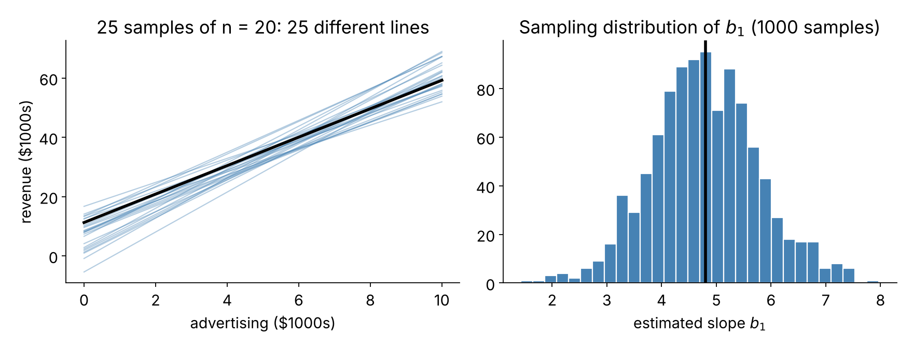
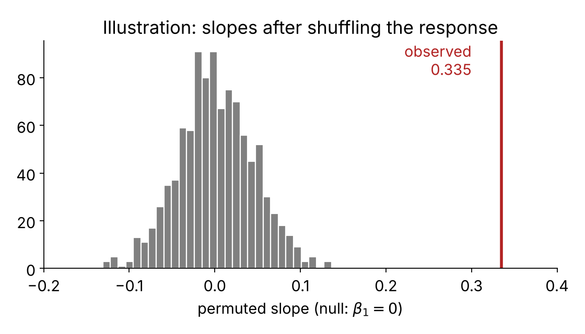
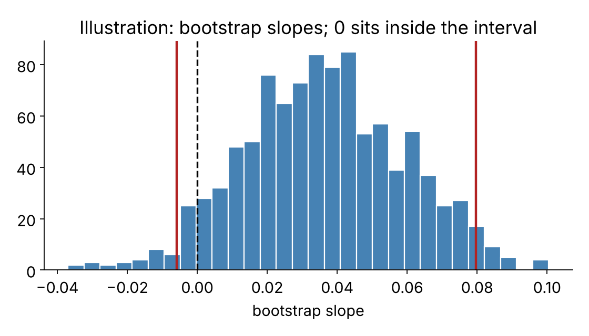
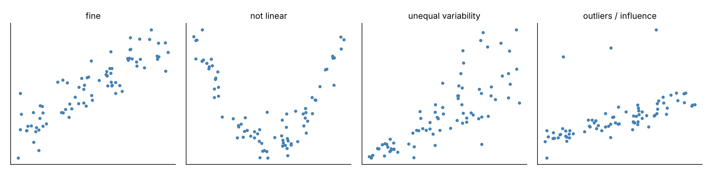

# Where we are

## 408 vs. this class

You have a separate course on *fitting* and *diagnosing* regression models. Here we ask the question we have asked all semester:

> If I had drawn a different sample, how different would my answer be?

. . .

The estimate $b_1$ (slope) is a **statistic**, just like $\hat{p}$ and $\bar{x}$. So it has a **sampling distribution**, and everything we know carries over:

- hypothesis test (randomization or math model)
- confidence interval (bootstrap or math model)
- conditions that tell us when to trust each

## The same recipe, a new parameter

| Parameter | Estimate | Null value |
|---|:---:|:---:|
| $p$ | $\hat{p}$ | $p_0$ |
| $\mu$ | $\bar{x}$ | $\mu_0$ |
| $\beta_1$ (slope) | $b_1$ | **0** |

. . .

Test statistic for a math model:

$$T = \frac{\text{estimate} - \text{null value}}{SE}$$

# The model and its estimates

## Population model vs. fitted line

Population (unknown): $\;y = \beta_0 + \beta_1 x + \varepsilon$

Sample (what we compute): $\;\hat{y} = b_0 + b_1 x$

- $b_0, b_1$ are **point estimates** of $\beta_0, \beta_1$.
- $\varepsilon$ is the part of $y$ the line does not explain.

. . .

The most common question: **is there any linear relationship at all?**

$$H_0: \beta_1 = 0 \qquad H_A: \beta_1 \ne 0$$

## A hypothetical: sandwich store revenue

Suppose we *knew* the truth for all stores:

$$\text{expected revenue} = 11.23 + 4.8 \times \text{advertising}$$

. . .

Now take random samples of $n = 20$ stores and fit a line each time.

{width=70% fig-align="center"}

. . .

Slopes vary from sample to sample, centered near the true 4.8. **That spread is what the standard error measures.**

# Randomization test for the slope

## births14: weight vs. weeks

100 births sampled from `births14`. Does gestation length help predict birth weight?

$$H_0: \beta_1 = 0 \qquad H_A: \beta_1 \ne 0$$

. . .

Observed slope: $b_1 = 0.335$ lb per week.

> How could we simulate a world where $\beta_1 = 0$?

. . .

**Shuffle the response.** If `weeks` and `weight` are unrelated, then any weight could have gone with any number of weeks.

## The permutation procedure

1. Keep the `weeks` column fixed.
2. Shuffle the `weight` column, breaking any link between the two.
3. Fit the line, record the slope.
4. Repeat many times to build the **null distribution**.
5. The p-value is the fraction of permuted slopes at least as extreme as the observed one.

. . .

{width=60% fig-align="center"}

Observed 0.335 is far outside the null slopes (which stay between about $-0.15$ and $0.15$). **Reject $H_0$.**

# Bootstrap interval for the slope

## Bootstrap: resample *rows*

A bootstrap sample draws **whole observations** $(x_i, y_i)$ with replacement, so each point keeps its partner.

1. Resample $n$ rows with replacement.
2. Fit the line, record $b_1^*$.
3. Repeat 1000+ times.

. . .

Two ways to build the interval:

- **Percentile:** middle 95% of bootstrap slopes.
- **SE method:** $b_1 \pm 2 \times SE_{boot}$ (or $t^*$ instead of 2).

## Example: weight vs. mother's age

`weight` ~ `mage` in the same 100 births. Observed slope $0.036$.

{width=55% fig-align="center"}

. . .

- Bootstrap percentile 95% CI: $(-0.01,\ 0.081)$
- Bootstrap SE $\approx 0.0225$, so $0.036 \pm 2(0.0225)$ gives about $(-0.009, 0.081)$

. . .

**The interval contains 0.** There is not convincing evidence that mother's age is linearly related to birth weight in these data.

## Intervals and tests agree

> The 95% CI contains 0. What does the two-sided test of $\beta_1 = 0$ say at $\alpha = 0.05$?

. . .

We **fail to reject**. Same logic as for means and proportions: a value inside the 95% interval would not be rejected at the 5% level.

# Math model: the t-test for the slope

## Reading regression output

`weight` ~ `weeks`:

| term | estimate | std.error | statistic | p.value |
|---|:---:|:---:|:---:|:---:|
| (Intercept) | $-5.72$ | 1.61 | $-3.54$ | 0.0006 |
| weeks | 0.34 | 0.04 | 8.07 | $<0.0001$ |

. . .

- `statistic` $= \dfrac{\text{estimate} - 0}{\text{std.error}}$, e.g. $\dfrac{0.335}{0.0415} \approx 8.07$
- `p.value` is **two-sided**, for $H_0:\beta = 0$
- Degrees of freedom: $n - 2$ (we estimated two parameters)

. . .

The intercept row tests $\beta_0 = 0$. Usually that is *not* the interesting question.

## Another example: weight vs. mother's age

| term | estimate | std.error | statistic | p.value |
|---|:---:|:---:|:---:|:---:|
| $\vdots$ | | | | |
| mage | 0.036 | 0.024 | 1.50 | 0.1362 |

. . .

$T = 0.036/0.024 = 1.50$ with 98 df gives $p = 0.136$. **Fail to reject.** This matches the bootstrap interval that contained 0.

## Confidence interval for a slope

$$b_1 \pm t^*_{df} \times SE$$

with $df = n-2$.

. . .

**Example: Elmhurst College.** Gift aid vs. family income (in \$1000s), $n = 50$:

$$\text{estimate} = -0.0431,\quad SE = 0.0108,\quad t^*_{48} = 2.01$$

$$-0.0431 \pm 2.01(0.0108) = (-0.0648,\ -0.0214)$$

. . .

> Interpret this interval in context.

. . .

We are 95% confident that for each additional \$1,000 of family income, the **average** gift aid falls by between about \$21 and \$65.

## Careful wording

Notice what we did *not* say:

- ~~"Each \$1,000 more income **causes** aid to drop..."~~ (observational data)
- ~~"A student with \$1,000 more income gets \$43 less."~~ (the slope describes an **average** over the population)
- The interval is for the **slope** $\beta_1$, not for individual students.

# Conditions

## When can we trust this? LINE

- **L**inearity: the data should show a linear trend.
- **I**ndependence: observations are independent of each other.
- **N**ormality: residuals are nearly normal.
- **E**qual variability: residuals have about the same spread at every $x$.

{width=90% fig-align="center"}

## Which conditions matter most?

. . .

- **Linearity and independence matter most.** If these fail, the slope is estimating the wrong thing, or the SE is wrong.
- Normality matters mostly for small $n$ and heavy outliers.
- Equal variability affects the SE; a curved or fanning residual plot is a warning.

. . .

**Randomization and bootstrap methods** lean less on Normality and Equal variability, so they are a good cross-check when the residual plot looks rough.

## Independence in practice: midterm elections

Do unemployment changes predict the president's party's House seat change?

Fitted line (Great Depression years removed): $\hat{y} = -7.36 - 0.89 \times \text{unemp}$

. . .

$$T = \frac{-0.89 - 0}{0.835} \approx -1.07, \quad p = 0.2961$$

. . .

> What do you conclude? What about the independence condition?

. . .

Fail to reject: no convincing linear relationship in these data. Elections that are a few years apart are plausibly independent, but time-ordered data are always worth a second look.

# Wrap-up

## Summary

- A slope $b_1$ is a statistic with a sampling distribution.
- **Test** $H_0:\beta_1 = 0$ by shuffling the response *or* with $T = b_1/SE$, $df = n-2$.
- **Interval** by bootstrapping rows *or* with $b_1 \pm t^*_{df}\,SE$.
- Check **L-I-N-E**; linearity and independence first.
- Tests and intervals agree.

. . .

**Next:** lab, where you run all of this with `lm()`, `broom`, and the `infer` package.
