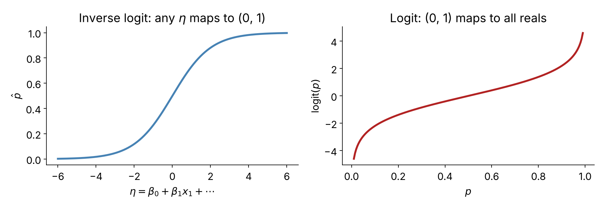

# Part 1: Multiple regression inference (Ch. 25)

## From one predictor to many

$$y = \beta_0 + \beta_1 x_1 + \beta_2 x_2 + \cdots + \beta_k x_k + \varepsilon$$

Everything from last time carries over:

- each $b_i$ has a standard error
- $T = \dfrac{b_i - 0}{SE_i}$, now with $df = n - k - 1$
- CI: $b_i \pm t^*_{df} \times SE_i$
- same LINE conditions

. . .

**What changes is the meaning of every hypothesis.**

## Each test is *conditional*

For predictor $x_i$:

$$H_0: \beta_i = 0 \ \text{given all the other variables in the model}$$
$$H_A: \beta_i \ne 0 \ \text{given all the other variables in the model}$$

. . .

So a small p-value says: *$x_i$ adds information beyond what the other predictors already provide.*

A large p-value does **not** say "$x_i$ is unrelated to $y$." It may be redundant with something else in the model.

## Example: loan interest rates

`loans_full_schema`: `interest_rate` ~ `debt_to_income` + `term` + `credit_checks`

| term | estimate | std.error | statistic | p.value |
|---|:---:|:---:|:---:|:---:|
| (Intercept) | 4.31 | 0.20 | | $<0.0001$ |
| debt_to_income | 0.04 | 0.00 | 13.3 | $<0.0001$ |
| term | 0.16 | 0.00 | 37.9 | $<0.0001$ |
| credit_checks | 0.25 | 0.02 | 12.8 | $<0.0001$ |

. . .

> Interpret the `credit_checks` row, including the hypothesis being tested.

. . .

Holding debt-to-income and term fixed, each additional credit check goes with an average **0.25 percentage point** increase in interest rate. The test rejects $\beta = 0$ given the other two variables are already in the model.

## Interpretation requires "holding others fixed"

The slope on `credit_checks` is **not** the slope you would get from a simple regression of `interest_rate` on `credit_checks`. It is the slope *after accounting for* the other predictors.

. . .

Same variable, different models, **different coefficients and different p-values**. Which brings us to...

# Multicollinearity

## Collinear predictors

When two predictors are strongly correlated, the model has trouble separating their effects.

. . .

**A coin-dish example** (invented data, $n = 26$): predict the dish's total value from the number of coins, and the number of *low-value* coins.

| model | coefficient(s) | p-value |
|---|:---:|:---:|
| `number_of_coins` alone | 0.13 | $<0.0001$ |
| `number_of_low_coins` alone | 0.02 | 0.7 |
| **both together** | 0.21 and $-0.16$ | $<0.0001$ for both |

. . .

- `number_of_low_coins` looked useless alone, but is highly significant *with* `number_of_coins`.
- Its coefficient even **flips sign**.

## What multicollinearity does

- Coefficients and SEs become unstable; small data changes can change signs.
- Individual p-values can be misleading (each variable looks redundant given the other).
- **Prediction** of $y$ can still be fine.

. . .

**Practical rules**

- Look at the correlation between predictors before interpreting coefficients.
- Interpret *sets* of related variables together, or drop one.
- Never read a single coefficient as "the effect of $x_i$" when predictors are tangled.

# Choosing a model

## Two goals, two answers

. . .

**Inference goal:** understand a relationship. Use p-values and intervals, think about confounders, and be honest about the number of tests run.

. . .

**Prediction goal:** forecast new observations. Use **cross-validation**: hold out data, predict it, and compare errors. P-values are not the main tool.

## Cross-validation example: penguins

Predict `body_mass_g` for 4 folds, comparing:

- **Small model:** `bill_length_mm` only ($\hat y = 362.3 + 87.4x$)
- **Large model:** adds `bill_depth_mm`, `flipper_length_mm`, `sex`, `species`

| model | 4-fold CV sum of squared errors |
|---|:---:|
| small | 141,552,822 |
| large | 27,728,698 |

. . .

The small model's CV error is about **5.1 times** the large model's. The extra variables really help prediction.

## Data snooping

If you try many models or many predictors and keep the best-looking, your p-values are too optimistic.

- Decide on the question and model **before** looking at the outcome when you can.
- Treat a surprising finding in a huge search as a **hypothesis**, not a result.
- Cross-validation on **held-out** data protects against overfitting.

# Part 2: Logistic regression background (Ch. 9)

## Why a new model?

Linear regression predicts a number. Many outcomes are **yes / no**:

- spam or not
- callback or not
- default or not

. . .

If we let $y \in \{0, 1\}$ and fit a line, predictions can land below 0 or above 1. We need a model for a **probability**.

## The logit link

Let $p$ = probability that $y = 1$. Model the **log-odds**:

$$\text{logit}(p) = \log\left(\frac{p}{1-p}\right) = \beta_0 + \beta_1 x_1 + \cdots + \beta_k x_k = \eta$$

. . .

Solve for $p$ (the inverse logit):

$$p = \frac{e^{\eta}}{1 + e^{\eta}}$$

{width=45% fig-align="center"}

Any value of $\eta$ maps to a valid probability.

## Example: resumes and callbacks

Bertrand and Mullainathan sent resumes to employers, randomly assigning names signalling race and sex. Response: `received_callback`.

Model with `honors` only:

$$\log\left(\frac{\hat p}{1-\hat p}\right) = -2.4998 + 0.8668 \times \text{honors}$$

. . .

> Find the predicted callback probability for a resume **without** honors, and **with** honors.

. . .

- No honors: $\eta = -2.4998 \Rightarrow \hat p = \dfrac{e^{-2.4998}}{1+e^{-2.4998}} \approx 0.076$
- Honors: $\eta = -2.4998 + 0.8668 = -1.633 \Rightarrow \hat p \approx 0.163$

## Interpreting a coefficient

- **Sign:** positive means higher probability.
- **Size:** a one-unit increase in $x_i$ changes the **log-odds** by $\beta_i$, which multiplies the **odds** by $e^{\beta_i}$.
- It does **not** add $\beta_i$ to the probability.

. . .

For `honors`: $e^{0.8668} \approx 2.4$. Holding other variables fixed, having honors multiplies the odds of a callback by about 2.4.

## Many predictors and AIC

The full model for `resume` had **AIC = 2677**.

**Backward elimination:** remove the variable whose removal lowers AIC the most; stop when no removal helps.

- Dropping `college_degree` gives AIC = 2676, which is better, so drop it.
- Lower AIC is better, with a penalty for each added parameter.

. . .

Reduced model:

| term | estimate |
|---|:---:|
| (Intercept) | $-2.72$ |
| job_city: Chicago | $-0.44$ |
| years_experience | 0.02 |
| honors | 0.76 |
| military | $-0.34$ |
| has_email_address | 0.22 |
| race: White | 0.44 |
| sex: man | $-0.20$ |

## A prediction

White man, Chicago, 14 years' experience, no honors, no military, has email:

$$\hat\eta = -2.72 - 0.44 + 0.02(14) + 0.22 + 0.44 - 0.20 \approx -2.4$$

$$\hat p = \frac{e^{-2.4}}{1+e^{-2.4}} \approx 0.08 \quad\Rightarrow\quad \text{about 12 applications per callback}$$

. . .

The same profile for a Black man has $\hat p \approx 0.054$, about 18 applications per callback.

. . .

> This is a prediction from the model. Is the *race* effect statistically significant? That is an **inference** question, which is next.

# Part 3: Inference for logistic regression (Ch. 26)

## Conditions

For logistic regression we need:

1. **Independence:** each outcome is independent of the others (given the predictors).
2. **Linearity in the logit:** each numerical predictor has a linear relationship with $\text{logit}(p)$.

. . .

No Normal-residuals condition and no constant-variance condition. The outcome is 0/1, so residuals do not look like a normal regression's.

. . .

The model-based tests and intervals also lean on large samples (Wald z-tests).

## Wald tests for each coefficient

Same recipe, now with a **z** statistic (not $t$):

$$Z = \frac{b_i - 0}{SE_i}, \qquad H_0: \beta_i = 0 \text{ given the other variables}$$

. . .

Confidence interval for a coefficient: $b_i \pm 1.96 \times SE_i$.

For an **odds ratio**, exponentiate the endpoints:

$$\left(e^{b_i - 1.96\,SE_i},\ e^{b_i + 1.96\,SE_i}\right)$$

## Example: spam email

`email` data, 3921 emails. Response: `spam`.

| term | estimate | std.error | z | p-value |
|---|:---:|:---:|:---:|:---:|
| (Intercept) | $-2.05$ | 0.06 | | |
| to_multiple | $-1.91$ | 0.30 | $-6.4$ | $<0.0001$ |
| cc | 0.02 | 0.02 | 1.0 | 0.245 |
| dollar | $-0.07$ | 0.02 | $-3.5$ | 0.0005 |
| urgent_subj | 2.66 | 0.80 | 3.3 | 0.0009 |

. . .

> Which predictors are significant at $\alpha = 0.05$? Which are not?

. . .

`to_multiple`, `dollar`, and `urgent_subj` are significant. `cc` is not (given the other three).

## Intervals for odds ratios

`urgent_subj`: $b = 2.66,\ SE = 0.80$

$$2.66 \pm 1.96(0.80) = (1.09,\ 4.23)$$

$$\text{odds ratio: } e^{2.66} \approx 14.3, \quad 95\%\text{ CI } (2.98,\ 68.6)$$

. . .

An urgent subject line multiplies the odds of spam by about 14 (plausibly anywhere from 3 to 69), holding the other predictors fixed.

. . .

`to_multiple`: $e^{-1.91} \approx 0.15$. Emails sent to multiple people have about **one seventh** the odds of being spam.

## Checking the model: diagnostics

Does $\hat p = 0.2$ really correspond to 20% spam?

1. Bucket the predicted probabilities (e.g., 0--0.1, 0.1--0.2, ...).
2. In each bucket compare the **average predicted** probability to the **observed** proportion of spam.
3. Points should fall near the diagonal.

. . .

Systematic gaps suggest the model is missing something (non-linearity, interactions, a variable).

## P-values or prediction?

Same two goals as before.

- **Inference:** Wald tests, intervals, odds ratios.
- **Prediction:** use **cross-validation accuracy** (e.g., true-positive rate for spam, true-positive rate for non-spam).

. . .

At a 10% cutoff, a one-variable model (`to_multiple`) catches nearly all spam (about 96--98%) but has overall accuracy only about 23--26%, because it flags too much. A 7-variable model reaches accuracy about 76--80% with spam caught about 65--75% of the time.

. . .

**A model can be significant and still be a poor predictor,** and a good predictor can contain non-significant variables.

# Wrap-up

## Summary: three regression models

| | Simple linear | Multiple linear | Logistic |
|---|:---:|:---:|:---:|
| Response | numeric | numeric | yes / no |
| Test stat | $t$, $df=n-2$ | $t$, $df=n-k-1$ | $z$ |
| $H_0$ | $\beta_1=0$ | $\beta_i=0$ given others | $\beta_i=0$ given others |
| Conditions | L I N E | L I N E | independence, linear in logit |

. . .

- Inference is **conditional** on the other variables in the model.
- **Multicollinearity** destabilizes individual coefficients.
- **Prediction** and **inference** are different goals with different tools.
- Simulation (`infer`) and math models give the same story when conditions hold.
