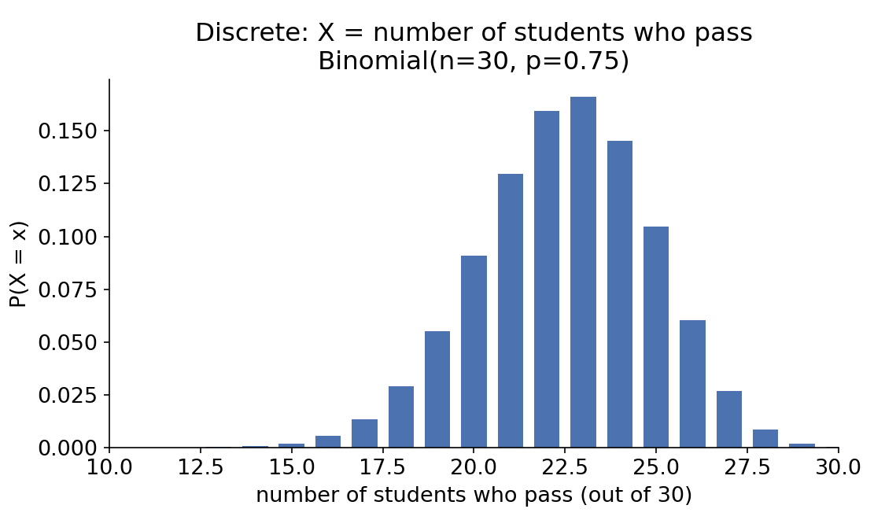
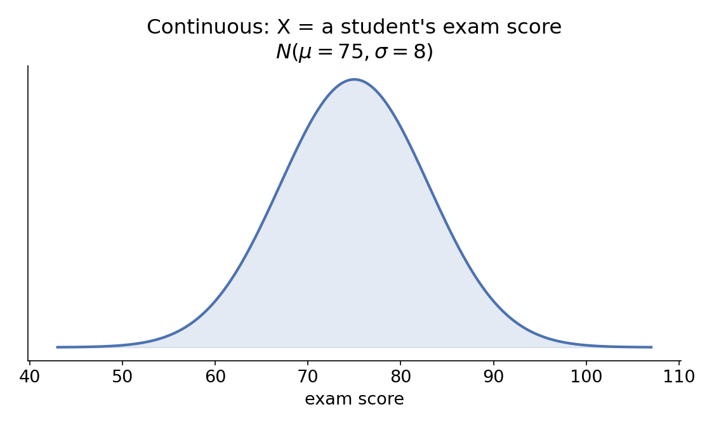
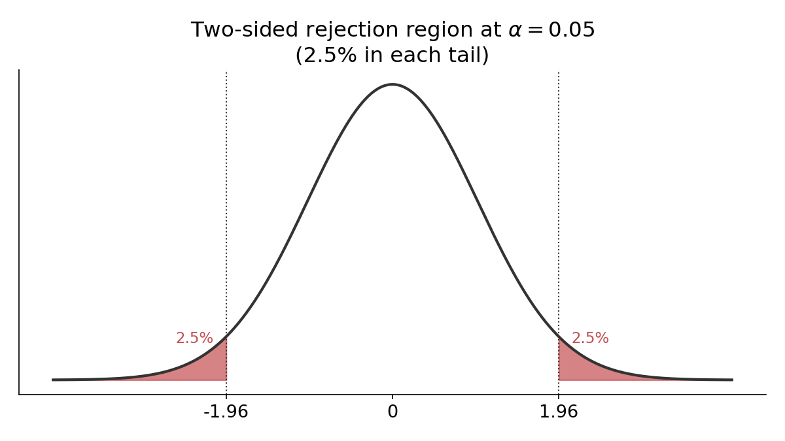
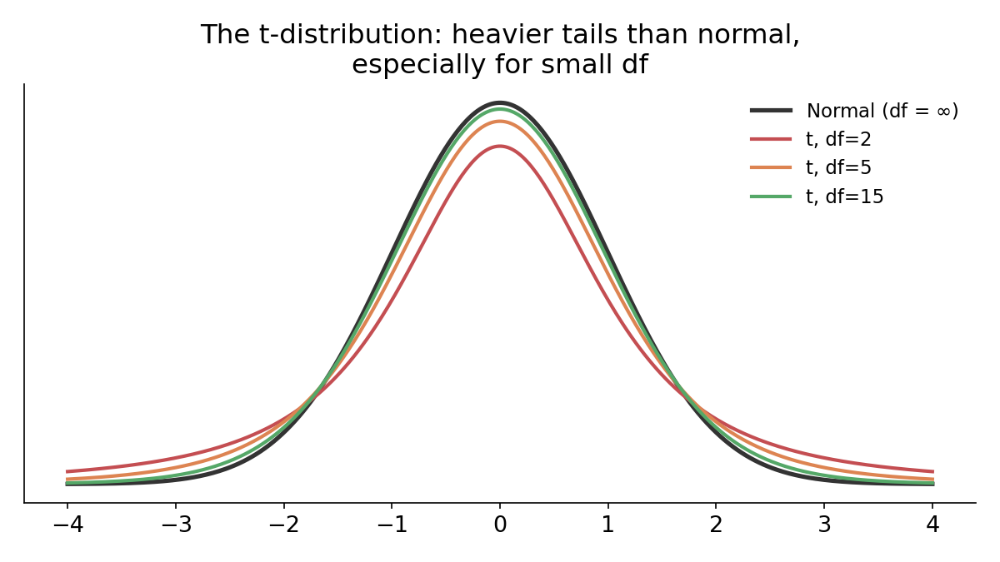

## The big picture

Today is a fast pass through the whole pipeline of statistical inference — the goal is to see how every piece connects, using **one running example** throughout.

::: {.callout-note title="Our example"}
A large statistics course. We care about two things: whether a given student **passes** (yes/no), and what **score** a given student earns (a number).
:::

**The roadmap:**

random variable $\to$ distribution (discrete \& continuous) $\to$ point estimate $\to$ sampling distribution $\to$ Central Limit Theorem $\to$ hypothesis test $\to$ t-test

Every step exists to answer one question: **we only ever see one sample — how do we make honest claims about the truth behind it?**

## What is a random variable?

::: {.callout-note title="Random variable"}
A numeric quantity whose value depends on the outcome of a random process.
:::

- We use a **capital letter**, like $X$, for the random variable itself — the *process* of observing an outcome.
- We use a **lowercase letter**, like $x$, for one particular observed value.
- Two flavors: **discrete** (a countable set of values) and **continuous** (any value in an interval).

In our example: $X = 1$ if a randomly chosen student passes, $0$ if not (discrete). $Y$ = a randomly chosen student's exam score (continuous).

## Discrete random variables

For our pass/fail variable $X$, suppose 75% of students pass ($p = 0.75$). $X$ is a **Bernoulli** random variable.

If we look at $n=30$ students and count how many pass, that total is **binomial**:

$$P(\text{exactly } k \text{ pass}) = \binom{n}{k}p^k(1-p)^{n-k}, \qquad \mu = np, \qquad \sigma = \sqrt{np(1-p)}$$

## Binomial Visual 

{width=65% fig-align="center"}

## Continuous random variables

Now consider $Y$ = a student's exam score. $Y$ can take *any* value in a range — there's no meaningful "next" value after 74.3.

For a continuous random variable, we describe probability with a **density curve** instead of a bar for each value:

- The probability of any single exact value is 0.
- Probabilities come from **areas** under the curve.
- The most important continuous distribution is the **normal distribution**, $N(\mu, \sigma)$.

## The normal distribution

{width=55% fig-align="center"}

Suppose exam scores follow $N(\mu=75, \sigma=8)$.

- **Standardizing:** $Z = \dfrac{y - \mu}{\sigma}$ tells you how many standard deviations $y$ is from the mean.
- The **68-95-99.7 rule**: about 68% of scores fall within 1 SD of 75, 95% within 2 SD, 99.7% within 3 SD.

## From individuals to samples: the key pivot

Everything so far described **individual** outcomes. Now the actual problem we care about: we don't know the *true* pass rate or *true* average score for the whole population of students who will ever take this course — we only have **one sample**.

| | Population (unknown truth) | Sample (what we observe) |
|---|:---:|:---:|
| Proportion | $p$ | $\hat{p}$ |
| Mean | $\mu$ | $\bar{x}$ |

$\hat{p}$ and $\bar{x}$ are **point estimates** — our best single guess at an unknown parameter, computed from data.

## The sampling distribution

> If we gave this exam to a new random sample of 30 students, would $\hat{p}$ come out exactly the same as last time?

No — every new sample gives a slightly different $\hat p$ (or $\bar x$), just from natural sampling variability. If we imagine repeating this over and over, those estimates form their own distribution: the **sampling distribution**.

- This isn't just a thought experiment — it's the key idea that lets us quantify *how much* we should trust a single estimate.
- Its spread has a special name: the **standard error (SE)** — literally the standard deviation of the sampling distribution.

## The Central Limit Theorem

::: {.callout-note title="CLT, for a proportion"}
$$\mu_{\hat p} = p, \qquad SE_{\hat p} = \sqrt{\frac{p(1-p)}{n}}$$
:::

::: {.callout-note title="CLT, for a mean"}
$$\mu_{\bar x} = \mu, \qquad SE_{\bar x} = \frac{\sigma}{\sqrt{n}}$$
:::

**In both cases:** when $n$ is large enough and observations are independent, the sampling distribution is approximately **normal**, centered at the truth, with spread that **shrinks as $n$ grows**. This is the single most important fact in this entire lecture — nearly everything else is built on it.

## Why does any of this matter?

Here's the actual situation we're always in: we have **one** sample, **one** $\hat p$ or $\bar x$ — and someone wants to know whether it reflects something *real*, or whether it's just what chance produced.

> Suppose 26 of our 30 students pass ($\hat p = 0.867$), and historically this course has a 75% pass rate. Is this new group of students doing *genuinely* better, or is this within the range of ordinary sample-to-sample bounce?

This is a **hypothesis test** — a formal way to make that judgment call, instead of eyeballing it.

## Setting up hypotheses

- $H_0$ (**null hypothesis**): the skeptical, "nothing unusual is happening" baseline. Here: $p = 0.75$.
- $H_A$ (**alternative hypothesis**): what we'd conclude if the data are convincing enough. Here: $p \ne 0.75$.

We assume $H_0$ until the data give us strong reason to abandon it — the same logic as "innocent until proven guilty." **Failing to reject $H_0$ never means we've proven it true** — only that we don't have strong enough evidence against it.

## One-sided vs. two-sided

- **One-sided:** $H_A$ claims a specific *direction* ($p > 0.75$, say). Only appropriate when you have a genuine, pre-existing reason to only care about one direction.
- **Two-sided:** $H_A$ allows *either* direction ($p \ne 0.75$). This is the **default, safer choice** — it keeps you honest about possibilities you didn't expect.

::: {.callout-note title="Why it matters"}
Deciding the direction *after* looking at the data — instead of before — silently inflates your true error rate. Default to two-sided unless you have a specific reason not to.
:::

## The test statistic

Whether we're testing a proportion or a mean, the same idea applies: **how many standard errors is our estimate from the null value?**

$$Z = \frac{\text{point estimate} - \text{null value}}{SE}$$

## Worked example: testing a proportion

$H_0: p=0.75$ vs. $H_A: p \ne 0.75$. Observed $\hat p = 26/30 = 0.867$.

. . .

$$SE_{\hat p} = \sqrt{\frac{0.75(0.25)}{30}} \approx 0.079$$

. . .

$$Z = \frac{0.867 - 0.75}{0.079} \approx 1.48$$

## Worked CI Cont. 

{width=60% fig-align="center"}

Two-sided p-value $= 2 \times P(Z > 1.48) \approx 0.139$. Since $0.139 > 0.05$, we **fail to reject $H_0$** — not enough evidence that this group's pass rate genuinely differs from 75%.

## Confidence intervals: the flip side of a test

A hypothesis test answers yes/no: *is $\hat p$ far enough from 0.75 to be convincing?* A **confidence interval** instead asks: *given our data, what's a plausible range for the true $p$?*

::: {.callout-note title="Confidence interval, general form"}
$$\text{point estimate} \pm z^\star \times SE$$
where $z^\star = 1.96$ for 95% confidence.
:::

Using our pass-rate example ($\hat p = 0.867$, $SE_{\hat p} \approx 0.079$):

## Answer 

$$0.867 \pm 1.96(0.079) = (0.712,\ 1.00)$$

**We are 95% confident** the true pass rate for this group is between 71.2% and 100%. Since this interval **contains** the null value 0.75, that's consistent with our earlier test's conclusion (fail to reject $H_0$) — the two methods agree, because they're built from the same $SE$.

## What about testing a mean?

Same logic, new variable: suppose this group of 30 students averaged $\bar{x} = 78$ on the exam, and historically $\mu_0 = 75$.

If we **knew** the population SD ($\sigma = 8$), we could plug straight into the same Z-formula:

$$SE_{\bar x} = \frac{\sigma}{\sqrt{n}} = \frac{8}{\sqrt{30}} \approx 1.46, \qquad Z = \frac{78-75}{1.46} \approx 2.05$$

**But here's the catch:** in practice, we almost never actually know $\sigma$. We only have our sample's standard deviation, $s$ — an estimate, with its own uncertainty.

## Enter the t-distribution

When we substitute the sample standard deviation $s$ for the unknown $\sigma$, we introduce *extra* uncertainty — and the normal distribution is no longer quite the right shape to use.

::: {.callout-note title="The t-distribution"}
Like the standard normal, but with **heavier tails** — reflecting the added uncertainty of estimating $\sigma$ with $s$. Indexed by **degrees of freedom**, $df = n - 1$.
:::

## T Distribution
{width=65% fig-align="center"}

As $n$ grows, $s$ becomes a better estimate of $\sigma$, and the t-distribution converges to the normal — that's why the two nearly overlap once $df$ is large.

## The t-test

::: {.callout-note title="One-sample t-statistic"}
$$t = \frac{\bar x - \mu_0}{s/\sqrt{n}}, \qquad df = n-1$$
:::

Mechanically **identical** to the Z-formula — same numerator, same idea of "estimate minus null value, divided by standard error" — the only change is *which reference distribution* we compare it to (t instead of normal), because we estimated $\sigma$ with $s$.

## Worked example: the t-test

Our 30 students: $\bar x = 78$, sample SD $s = 8.5$, testing $H_0: \mu = 75$ vs. $H_A: \mu \ne 75$.

$$SE = \frac{s}{\sqrt{n}} = \frac{8.5}{\sqrt{30}} \approx 1.55, \qquad t = \frac{78-75}{1.55} \approx 1.93, \qquad df = 29$$

Looking up (or using software for) a t-distribution with 29 df: two-sided p-value $\approx 0.063$.

In R: `t.test(scores, mu = 75)` does this entire calculation — statistic, degrees of freedom, p-value, and confidence interval — in one line.

## Putting it side by side

| | Proportion | Mean |
|---|:---:|:---:|
| Point estimate | $\hat p$ | $\bar x$ |
| $SE$ | $\sqrt{p(1-p)/n}$ | $s/\sqrt n$ |
| Reference distribution | Normal | **t** ($df=n-1$) |
| R function | `prop.test()` | `t.test()` |

Same underlying logic throughout: **(estimate $-$ null value) / SE**, compared against a reference distribution to get a p-value.

## Interpreting the result, carefully

- A p-value is $P(\text{data this extreme} \mid H_0 \text{ true})$ — **not** the probability $H_0$ is true.
- "Fail to reject $H_0$" $\ne$ "$H_0$ is true" — it means the evidence wasn't strong enough to abandon our skeptical starting point, given this sample size.
- Statistical results answer "how surprising is this, assuming nothing unusual is happening?" — they don't automatically tell you whether an effect is *large* or *practically* important.

## Recap: the whole pipeline

1. A **random variable** describes an uncertain numeric outcome — discrete or continuous.
2. A **distribution** (binomial, normal, ...) describes the full range of values it could take and how likely each is.
3. From data, we compute a **point estimate** ($\hat p$ or $\bar x$) of an unknown population parameter.
4. The **CLT** tells us that estimate's own sampling distribution is approximately normal, for large enough $n$.
5. A **hypothesis test** asks: is our estimate far enough from a claimed null value to be convincing, given how much natural variability we'd expect?
6. When we must estimate $\sigma$ with $s$, we use the **t-distribution** instead of the normal — same logic, adjusted reference distribution.

Every later topic in this course is a variation on this same pipeline.
